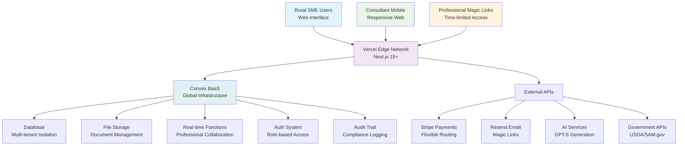
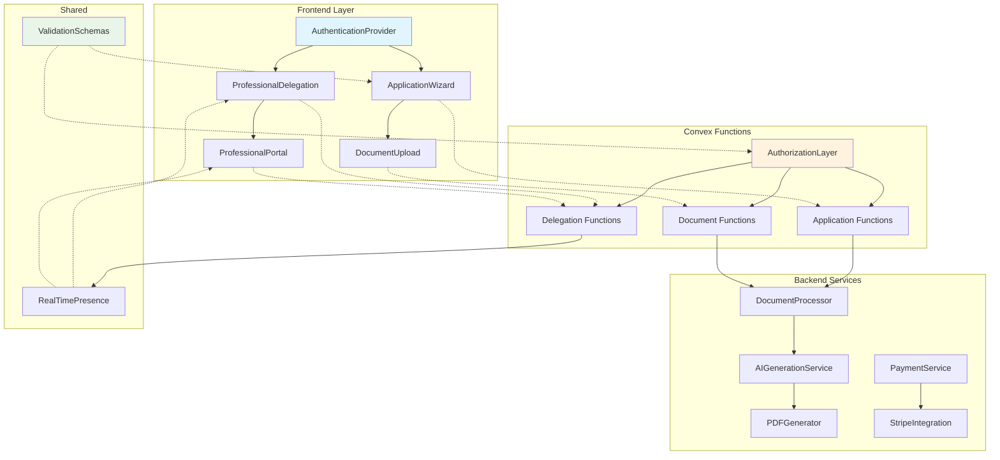
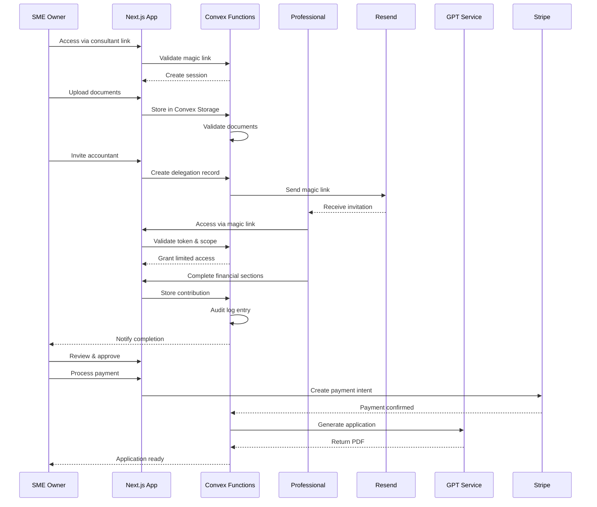
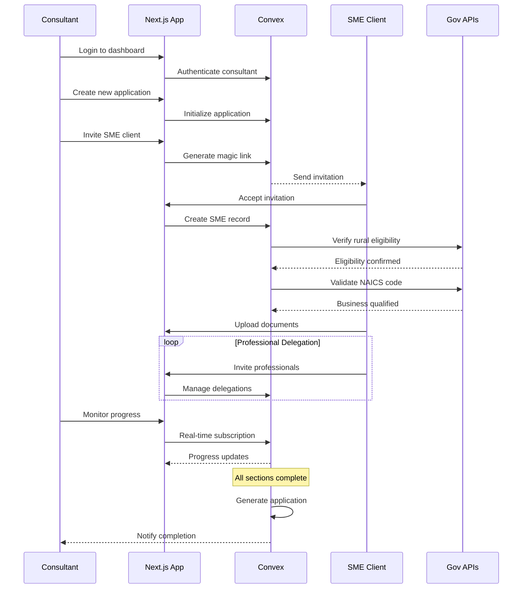
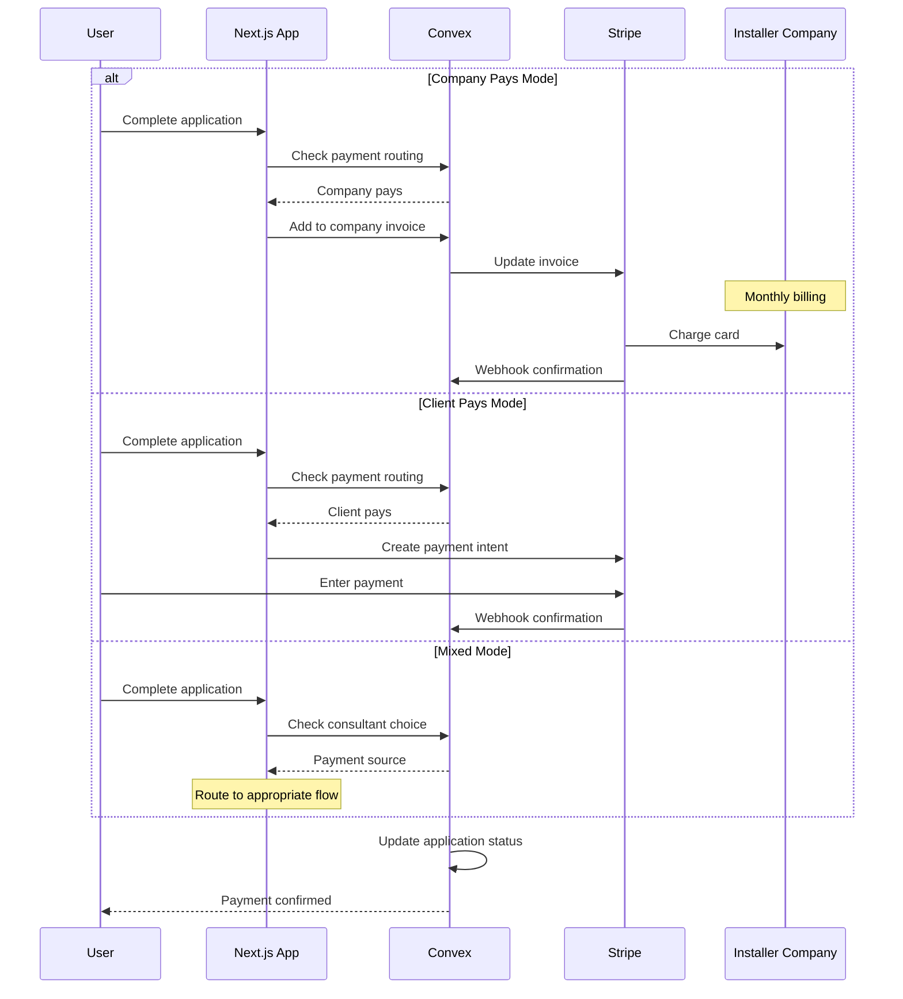
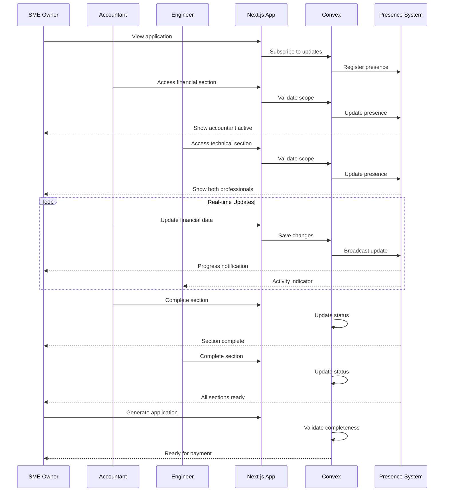

# reapSpring Fullstack Architecture Document

*Generated using BMAD Core Fullstack Architecture Template v2.0*

---

## Introduction

This document outlines the complete fullstack architecture for **reapSpring**, including backend systems, frontend implementation, and their integration. It serves as the single source of truth for AI-driven development, ensuring consistency across the entire technology stack.

This unified approach combines what would traditionally be separate backend and frontend architecture documents, streamlining the development process for modern fullstack applications where these concerns are increasingly intertwined.

### Starter Template Decision: Official Convex Next.js Setup

**Decision:** Use the official Convex Next.js quickstart setup from https://docs.convex.dev/quickstart/nextjs

**Rationale:** 
- **Maximum Development Speed:** Official setup eliminates configuration complexity
- **Zero Integration Risk:** Guaranteed compatibility between Convex and Next.js
- **Battle-tested Foundation:** Optimized setup used by thousands of Convex projects
- **Immediate Productivity:** Team can start building features immediately after setup

**Setup Foundation:**
```bash
npx create-next-app@latest reapspring
cd reapspring  
npm install convex
npx convex dev
```

This provides the exact foundation specified in your PRD (Next.js 15+ with Convex BaaS) with zero integration overhead.

### Change Log
| Date | Version | Description | Author |
|------|---------|-------------|---------|
| 2025-09-10 | v1.0 | Initial architecture document creation | Winston (Architect) |

---

## High Level Architecture

### Technical Summary

reapSpring employs a **modern serverless-first fullstack architecture** using Next.js 15+ with Convex BaaS for rapid development and automatic scaling. The **professional delegation system** serves as the core architectural differentiator, enabling secure, granular access controls for external professionals (accountants, advisors, engineers) within multi-tenant installer company hierarchies. **AI-powered application generation** transforms uploaded documents and professional contributions into federal-ready REAP grants through template-based GPT integration. The platform deploys via **Vercel's edge network** with **Convex's global infrastructure** handling real-time collaboration, file storage, and database operations, ensuring sub-200ms response times for rural users while automatically scaling for October 1st traffic surges.

### Platform and Infrastructure Choice  

**Platform:** Vercel Edge Deployment  
**Key Services:** Convex BaaS (Database, Functions, Auth, File Storage, Real-time), Vercel Edge Functions  
**Deployment Host and Regions:** Global edge with primary regions in US East/West

### Repository Structure

**Structure:** Monorepo (Next.js + Convex)  
**Monorepo Tool:** Native Next.js structure with Convex integration  
**Package Organization:** Single package with clear separation between frontend (`app/`) and backend (`convex/`) concerns

### High Level Architecture Diagram



### Architectural Patterns

- **Jamstack Architecture:** Static generation with serverless functions - _Rationale:_ Optimal performance for document-heavy workflows with global edge distribution
- **Multi-tenant SaaS Pattern:** Hierarchical data isolation (Company → Manager → Consultant → SME) - _Rationale:_ Supports installer company business model with secure data boundaries
- **Professional Delegation Pattern:** Granular access control with time-limited permissions - _Rationale:_ Core competitive differentiator enabling trusted professional relationships
- **Event-driven Architecture:** Real-time collaboration through Convex mutations - _Rationale:_ Essential for professional coordination and manager dashboards
- **Template-based AI Generation:** Structured content creation with validation - _Rationale:_ Ensures federal compliance while maintaining application quality
- **Magic Link Authentication:** Passwordless professional access - _Rationale:_ Eliminates friction for external professionals who don't want platform accounts
- **Custom Functions Pattern:** Convex custom functions for authorization per https://stack.convex.dev/custom-functions - _Rationale:_ Enables granular professional delegation security model
- **End-to-End TypeScript:** Shared types between client/server per https://stack.convex.dev/end-to-end-ts - _Rationale:_ Zero type synchronization overhead
- **Presence-Based Collaboration:** Real-time professional coordination per https://stack.convex.dev/presence-with-convex - _Rationale:_ Essential for multi-professional workflows
- **Zod Validation Pipeline:** Server-side validation with Zod 4 per https://stack.convex.dev/typescript-zod-function-validation - _Rationale:_ Type-safe business logic validation
- **Row-Level Security:** Document access controls per https://stack.convex.dev/authorization - _Rationale:_ SME data isolation for professional delegation

---

## Tech Stack

This is the **DEFINITIVE technology selection** for the entire reapSpring project. All development must use these exact versions and technologies.

### Technology Stack Table

| Category | Technology | Version | Purpose | Rationale |
|----------|------------|---------|---------|-----------|
| Frontend Language | TypeScript | 5.3+ | Type-safe frontend development | End-to-end type safety with Convex, prevents runtime errors |
| Frontend Framework | Next.js | 15+ | React framework with App Router | Latest features per technical preferences, SSR/SSG for performance |
| UI Component Library | shadcn/ui + blocks | Latest | Pre-built accessible components | Rapid UI development with tweakcn theming support |
| State Management | XState | 5+ | Complex multi-step forms | Professional delegation workflows require state machines |
| Backend Language | TypeScript | 5.3+ | Type-safe backend development | Shared types with frontend via Convex |
| Backend Framework | Convex | Latest | Serverless backend functions | Real-time, auto-scaling, professional delegation security |
| API Style | Convex Functions | - | Type-safe RPC | Direct function calls with TypeScript inference |
| Database | Convex Database | - | Document database with ACID | Multi-tenant isolation, real-time subscriptions |
| Cache | Convex Built-in | - | Automatic query caching | Reduces AI generation costs, improves performance |
| File Storage | Convex File Storage | - | Secure document uploads | Professional document isolation, automatic CDN |
| Authentication | Convex Auth | Latest | Multi-tenant auth system | Magic links, role-based access, professional delegation |
| Frontend Testing | Vitest | 3.2+ | Unit and component testing | Fast, ESM-native testing framework |
| Backend Testing | Convex Test | - | Backend function testing | Test Convex functions with mock context |
| E2E Testing | Playwright | 1.55+ | Browser automation testing | Critical user journey validation |
| Build Tool | Next.js/Turbopack | 15+ | Frontend bundling | Faster builds with Turbopack |
| Bundler | Turbopack | Latest | Asset bundling | 10x faster than Webpack |
| IaC Tool | Vercel CLI | Latest | Deployment configuration | Simple deployment management |
| CI/CD | GitHub Actions | - | Automated testing/deployment | Integration with Vercel and Convex |
| Monitoring | Vercel Analytics | - | Performance monitoring | Real user metrics, Core Web Vitals |
| Logging | Convex Logs | - | Function execution logs | Debug professional delegation flows |
| CSS Framework | TailwindCSS | 4+ | Utility-first styling | Rapid development with dark mode support |
| Form Library | React Hook Form | 7.62.0+ | Form state management | Performance with large REAP forms |
| Validation | Zod | 4+ | Schema validation | Type-safe validation, Zod Mini for client |
| Icons | Lucide | Latest | Icon library | Consistent iconography per UI spec |
| Email Service | Resend | Latest | Transactional emails | Magic links, professional invitations |
| Payment Processing | Stripe | Latest | Payment infrastructure | Flexible routing for installer companies |
| AI Service (Dev) | GPT-OSS-20b | - | Development AI generation | Free tier for development |
| AI Service (Prod) | GPT-5 | Latest | Production AI generation | High-quality REAP applications |
| Maps | Mapbox | Latest | Rural area visualization | USDA rural boundary display |
| Component Docs | Storybook | 9+ | Component documentation | Visual component development |

---

## Data Models

Define the core data models/entities that will be shared between frontend and backend using Convex's type system per https://stack.convex.dev/end-to-end-ts.

### InstallerCompany Model

**Purpose:** Represents the top-level organization (solar installer companies) that manage consultants and pay for applications

**Key Attributes:**
- `_id`: `Id<"installerCompanies">` - Unique identifier
- `name`: `string` - Company name
- `billingAddress`: `object` - Company billing information
- `paymentMethodId`: `string` - Stripe payment method
- `paymentRouting`: `"company" | "client" | "mixed"` - Payment configuration
- `subscriptionTier`: `"starter" | "growth" | "enterprise"` - Plan level

**TypeScript Interface:**
```typescript
// Using Convex's type system - no manual interface needed
export const installerCompanies = defineTable({
  name: v.string(),
  billingAddress: v.object({
    street: v.string(),
    city: v.string(),
    state: v.string(),
    zip: v.string()
  }),
  paymentMethodId: v.string(),
  paymentRouting: v.union(v.literal("company"), v.literal("client"), v.literal("mixed")),
  subscriptionTier: v.union(v.literal("starter"), v.literal("growth"), v.literal("enterprise")),
  createdAt: v.number()
}).index("by_name", ["name"]);
```

**Relationships:**
- Has many Users (consultants, managers, admins)
- Has many SMEClients through consultants
- Has many Applications

### User Model

**Purpose:** Represents all platform users including consultants, managers, admins, and SME owners

**Key Attributes:**
- `email`: `string` - User email
- `role`: `"accountAdmin" | "consultantManager" | "consultant" | "smeOwner"` - User role
- `installerCompanyId`: `Id<"installerCompanies">` | `null` - Company association
- `profile`: `object` - User profile data
- `isActive`: `boolean` - Account status

**TypeScript Interface:**
```typescript
export const users = defineTable({
  email: v.string(),
  role: v.union(
    v.literal("accountAdmin"),
    v.literal("consultantManager"), 
    v.literal("consultant"),
    v.literal("smeOwner")
  ),
  installerCompanyId: v.optional(v.id("installerCompanies")),
  profile: v.object({
    firstName: v.string(),
    lastName: v.string(),
    phone: v.optional(v.string()),
    title: v.optional(v.string())
  }),
  isActive: v.boolean()
}).index("by_email", ["email"])
  .index("by_company", ["installerCompanyId"]);
```

**Relationships:**
- Belongs to InstallerCompany (for non-SME roles)
- Has many Applications (as consultant)
- Has many ProfessionalDelegations (as SME owner)

### SMEClient Model

**Purpose:** Rural small/medium enterprise businesses applying for REAP grants

**Key Attributes:**
- `businessName`: `string` - Business name
- `naicsCode`: `string` - 6-digit NAICS classification
- `ein`: `string` - Employer ID number
- `ruralAddress`: `object` - Business location
- `samRegistration`: `string` | `null` - SAM.gov UEI
- `ownerUserId`: `Id<"users">` - SME owner user
- `consultantId`: `Id<"users">` - Assigned consultant

**TypeScript Interface:**
```typescript
export const smeClients = defineTable({
  businessName: v.string(),
  naicsCode: v.string(),
  ein: v.string(),
  ruralAddress: v.object({
    street: v.string(),
    city: v.string(),
    state: v.string(),
    zip: v.string(),
    county: v.string(),
    ruralPopulation: v.number()
  }),
  samRegistration: v.optional(v.string()),
  ownerUserId: v.id("users"),
  consultantId: v.id("users"),
  energyBaseline: v.optional(v.object({
    annualUsageKwh: v.number(),
    annualCost: v.number(),
    peakDemandKw: v.number()
  }))
}).index("by_consultant", ["consultantId"])
  .index("by_owner", ["ownerUserId"]);
```

**Relationships:**
- Belongs to User (as owner)
- Belongs to User (as consultant)
- Has many Applications
- Has many Documents

### Application Model

**Purpose:** REAP grant application with professional delegation tracking

**Key Attributes:**
- `smeClientId`: `Id<"smeClients">` - SME client
- `status`: `ApplicationStatus` - Current state
- `projectType`: `"solar" | "wind" | "efficiency"` - Project category
- `systemSize`: `object` - System specifications
- `financials`: `object` - Project financial data
- `scoring`: `object` - REAP scoring optimization

**TypeScript Interface:**
```typescript
export const applications = defineTable({
  smeClientId: v.id("smeClients"),
  consultantId: v.id("users"),
  status: v.union(
    v.literal("draft"),
    v.literal("documentsUploaded"),
    v.literal("professionalReview"),
    v.literal("aiGenerated"),
    v.literal("paymentPending"),
    v.literal("submitted"),
    v.literal("approved"),
    v.literal("rejected")
  ),
  projectType: v.union(v.literal("solar"), v.literal("wind"), v.literal("efficiency")),
  systemSize: v.object({
    capacity: v.number(),
    estimatedProduction: v.number(),
    offsetPercentage: v.number()
  }),
  financials: v.object({
    projectCost: v.number(),
    reapGrantRequest: v.number(),
    matchingFunds: v.number()
  }),
  scoring: v.object({
    energyOffset: v.number(),
    ruralImpact: v.number(),
    agricultural: v.boolean(),
    estimatedScore: v.number()
  }),
  pdfUrl: v.optional(v.string()),
  submittedAt: v.optional(v.number())
}).index("by_sme", ["smeClientId"])
  .index("by_consultant", ["consultantId"])
  .index("by_status", ["status"]);
```

**Relationships:**
- Belongs to SMEClient
- Belongs to User (consultant)
- Has many ProfessionalDelegations
- Has many Documents

### ProfessionalDelegation Model

**Purpose:** Secure, time-limited access for external professionals (accountants, engineers, advisors)

**Key Attributes:**
- `applicationId`: `Id<"applications">` - Related application
- `professionalEmail`: `string` - Professional's email
- `scope`: `"financial" | "technical" | "legal"` - Access scope
- `magicLinkToken`: `string` - Secure access token
- `expiresAt`: `number` - Token expiration
- `completedAt`: `number` | `null` - Completion timestamp

**TypeScript Interface:**
```typescript
export const professionalDelegations = defineTable({
  applicationId: v.id("applications"),
  smeOwnerId: v.id("users"),
  professionalEmail: v.string(),
  professionalType: v.union(
    v.literal("accountant"),
    v.literal("engineer"),
    v.literal("advisor")
  ),
  scope: v.union(
    v.literal("financial"),
    v.literal("technical"),
    v.literal("legal")
  ),
  magicLinkToken: v.string(),
  createdAt: v.number(),
  expiresAt: v.number(),
  acceptedAt: v.optional(v.number()),
  completedAt: v.optional(v.number()),
  contributionData: v.optional(v.any()),
  auditLog: v.array(v.object({
    action: v.string(),
    timestamp: v.number(),
    ipAddress: v.optional(v.string())
  }))
}).index("by_token", ["magicLinkToken"])
  .index("by_application", ["applicationId"])
  .index("by_email", ["professionalEmail"]);
```

**Relationships:**
- Belongs to Application
- Belongs to User (SME owner who invited)
- Creates audit trail entries

---

## API Specification

Based on Convex Functions architecture, the API uses type-safe RPC with automatic TypeScript inference instead of traditional REST/GraphQL.

### Convex Functions Architecture

Following patterns from https://stack.convex.dev/custom-functions and https://stack.convex.dev/typescript-zod-function-validation:

**Core Function Categories:**
- **Authentication Functions** - Magic links, role verification, session management
- **Application Functions** - CRUD operations, status transitions, workflow management
- **Professional Delegation Functions** - Invitations, access control, contribution tracking
- **Document Functions** - Upload, processing, validation, storage
- **AI Generation Functions** - Application generation, scoring optimization
- **Payment Functions** - Stripe integration, routing logic, invoice generation

### Key Function Implementations

#### Authentication & Magic Links
```typescript
// Send magic link for SME or Professional access
export const sendMagicLink = action({
  args: {
    email: v.string(),
    role: v.union(v.literal("smeOwner"), v.literal("professional")),
    delegationId: v.optional(v.id("professionalDelegations"))
  },
  handler: async (ctx, args) => {
    const token = generateSecureToken();
    const expiresAt = Date.now() + 48 * 60 * 60 * 1000; // 48 hours
    
    await sendEmail({
      to: args.email,
      template: "magic-link",
      data: { token, expiresIn: "48h" }
    });
    
    return { success: true };
  }
});
```

#### Application Management with Validation
```typescript
// Create new REAP application with Zod validation
import { z } from "zod";
import { zid } from "convex-helpers/server/zod";
import { zCustomMutation } from "convex-helpers/server/zod";

const createApplicationSchema = z.object({
  smeClientId: zid("smeClients"),
  projectType: z.enum(["solar", "wind", "efficiency"]),
  systemSize: z.object({
    capacity: z.number().min(1).max(1000),
    offsetPercentage: z.number().min(50).max(150)
  })
});

const zMutation = zCustomMutation(mutation, requireAuth);

export const createApplication = zMutation({
  args: createApplicationSchema,
  returns: zid("applications"),
  handler: async (ctx, args) => {
    // ctx.user available from requireAuth
    if (ctx.user.role !== "consultant") {
      throw new Error("Unauthorized");
    }
    
    const applicationId = await ctx.db.insert("applications", {
      ...args,
      consultantId: ctx.user._id,
      status: "draft",
      createdAt: Date.now()
    });
    
    return applicationId;
  }
});
```

#### Professional Delegation Authorization
```typescript
// Custom function for professional access with granular permissions
export const acceptProfessionalInvitation = customMutation({
  args: {
    magicToken: v.string(),
    delegationId: v.id("professionalDelegations")
  },
  input: async (ctx, args) => {
    const delegation = await ctx.db.get(args.delegationId);
    
    if (!delegation || delegation.magicLinkToken !== args.magicToken) {
      throw new Error("Invalid or expired magic link");
    }
    
    if (Date.now() > delegation.expiresAt) {
      throw new Error("Invitation has expired");
    }
    
    return {
      ctx: {
        db: ctx.db,
        delegation,
        permissions: {
          scope: delegation.scope,
          applicationId: delegation.applicationId
        }
      },
      args: {}
    };
  },
  handler: async (ctx, args) => {
    await ctx.db.patch(ctx.delegation._id, {
      acceptedAt: Date.now(),
      status: "active"
    });
    
    await ctx.db.insert("auditLogs", {
      action: "professional_access_granted",
      delegationId: ctx.delegation._id,
      timestamp: Date.now()
    });
    
    return { success: true, scope: ctx.delegation.scope };
  }
});
```

#### Real-time Collaboration
```typescript
// Subscribe to application progress for live updates
export const watchApplicationProgress = query({
  args: { applicationId: v.id("applications") },
  handler: async (ctx, args) => {
    const application = await ctx.db.get(args.applicationId);
    
    const delegations = await ctx.db
      .query("professionalDelegations")
      .withIndex("by_application", q => q.eq("applicationId", args.applicationId))
      .filter(q => q.neq(q.field("status"), "expired"))
      .collect();
    
    const progress = {
      documentsUploaded: application?.documents?.length || 0,
      professionalsInvited: delegations.length,
      professionalsCompleted: delegations.filter(d => d.completedAt).length,
      readyForGeneration: delegations.every(d => d.completedAt !== null)
    };
    
    return { application, delegations, progress };
  }
});
```

#### AI Generation
```typescript
// Generate REAP application using AI
export const generateREAPApplication = action({
  args: {
    applicationId: v.id("applications"),
    useProductionAI: v.boolean()
  },
  handler: async (ctx, args) => {
    const application = await ctx.runQuery(api.applications.getComplete, {
      applicationId: args.applicationId
    });
    
    if (!application.allSectionsComplete) {
      throw new Error("Application incomplete");
    }
    
    const aiService = args.useProductionAI ? "gpt-5" : "gpt-oss-20b";
    const generatedContent = await generateWithAI({
      service: aiService,
      template: "reap-application",
      data: application
    });
    
    await ctx.runMutation(api.applications.updateAIContent, {
      applicationId: args.applicationId,
      content: generatedContent
    });
    
    return { success: true, pdfUrl: generatedContent.pdfUrl };
  }
});
```

### API Security Patterns

- **Authentication Required:** All mutations verify user identity via Convex Auth
- **Role-Based Access:** Functions check user roles before operations
- **Magic Link Validation:** Time-limited tokens with single-use enforcement
- **Row-Level Security:** Document access filtered by user permissions
- **Audit Logging:** All sensitive operations logged for compliance
- **Rate Limiting:** Built-in Convex rate limiting for API protection

---

## Components

Based on the architectural patterns, tech stack, and data models, here are the major logical components/services across the fullstack.

### Frontend Components

#### AuthenticationProvider
**Responsibility:** Manages user authentication state, magic link handling, and role-based access control across the application

**Key Interfaces:**
- `useAuth()` - Hook for accessing current user and role
- `useMagicLink()` - Hook for magic link authentication flow
- `usePermissions()` - Hook for checking user permissions

**Dependencies:** Convex Auth, React Context

**Technology Stack:** React 19+, Convex Auth, TypeScript

#### ApplicationWizard
**Responsibility:** Multi-step form component managing REAP application creation with XState state machine

**Key Interfaces:**
- `ApplicationMachine` - XState machine for application flow
- `StepValidator` - Zod schemas for each step
- `ProgressTracker` - Visual progress indicator

**Dependencies:** XState 5+, React Hook Form, Zod validation

**Technology Stack:** React 19+, XState 5+, React Hook Form 7.62+, Zod 4+

#### ProfessionalDelegation
**Responsibility:** Manages invitation, tracking, and status of professional delegations

**Key Interfaces:**
- `InviteProfessional` - Send invitation component
- `DelegationStatus` - Real-time delegation tracking
- `ProfessionalPortal` - Scoped access interface

**Dependencies:** Convex real-time subscriptions, Resend email service

**Technology Stack:** React 19+, Convex queries/mutations, shadcn/ui components

### Backend Components

#### AuthorizationLayer
**Responsibility:** Custom Convex functions implementing row-level security and professional access control

**Key Interfaces:**
- `customQuery` - Authorized query wrapper
- `customMutation` - Authorized mutation wrapper
- `validateProfessionalAccess` - Magic link validation

**Dependencies:** Convex custom functions pattern

**Technology Stack:** TypeScript, Convex Functions, Zod validation

#### DocumentProcessor
**Responsibility:** Handles document upload, storage, validation, and data extraction

**Key Interfaces:**
- `uploadDocument` - File upload handler
- `extractFinancialData` - Parse financial documents
- `validateDocuments` - Check document completeness

**Dependencies:** Convex File Storage, PDF parsing libraries

**Technology Stack:** Convex Actions, TypeScript, PDF processing

#### AIGenerationService
**Responsibility:** Interfaces with GPT services to generate REAP applications

**Key Interfaces:**
- `generateApplication` - Main generation function
- `optimizeScoring` - REAP score optimization
- `validateCompliance` - Federal compliance check

**Dependencies:** GPT-OSS-20b (dev), GPT-5 (prod)

**Technology Stack:** Convex Actions, AI API integration, Template engine

### Shared Components

#### ValidationSchemas
**Responsibility:** Centralized Zod schemas used across frontend and backend

**Key Interfaces:**
- `applicationSchemas` - Application validation rules
- `professionalSchemas` - Professional delegation validation
- `financialSchemas` - Financial data validation

**Dependencies:** Zod 4+, Zod Mini (client-side)

**Technology Stack:** TypeScript, Zod 4+

#### RealTimePresence
**Responsibility:** Manages real-time collaboration features for professional coordination

**Key Interfaces:**
- `usePresence` - Hook for presence state
- `ProfessionalActivity` - Activity indicators
- `CollaborationStatus` - Real-time status updates

**Dependencies:** Convex presence patterns per https://stack.convex.dev/presence-with-convex

**Technology Stack:** Convex subscriptions, React hooks

### Component Interaction Diagram



---

## External APIs

For each external service integration required by the platform:

### Stripe API
**Purpose:** Payment processing with flexible routing for installer companies vs. SME direct payments

**Documentation:** https://stripe.com/docs/api

**Base URL(s):** https://api.stripe.com/v1

**Authentication:** Secret key authentication via Convex environment variables

**Rate Limits:** 100 requests/second for most endpoints

**Key Endpoints Used:**
- `POST /v1/payment_intents` - Create payment for applications
- `POST /v1/customers` - Create customer records for installer companies
- `POST /v1/payment_methods` - Attach payment methods
- `POST /v1/invoices` - Generate invoices for company billing
- `POST /v1/webhooks` - Handle payment events

**Integration Notes:** Webhook handlers must be implemented as Convex HTTP actions for payment confirmation. Store minimal payment data in Convex, keeping sensitive data in Stripe.

### Resend API
**Purpose:** Transactional email for magic links, professional invitations, and application status updates

**Documentation:** https://resend.com/docs/api-reference

**Base URL(s):** https://api.resend.com

**Authentication:** API key authentication

**Rate Limits:** 100 emails/second, 10,000/hour

**Key Endpoints Used:**
- `POST /emails` - Send transactional emails
- `POST /batch` - Batch send for notifications
- `GET /emails/{id}` - Track email delivery status

**Integration Notes:** Email templates should be stored in Convex for version control. Professional invitation emails must include secure magic link tokens with 48-hour expiration.

### USDA Rural Development API
**Purpose:** Verify rural area eligibility for REAP applications

**Documentation:** https://www.rd.usda.gov/files/RD_Eligibility_API.pdf

**Base URL(s):** https://eligibility.sc.egov.usda.gov/eligibility

**Authentication:** Public API (no auth required)

**Rate Limits:** 10 requests/second

**Key Endpoints Used:**
- `GET /addressVerification` - Verify rural address eligibility
- `GET /propertyEligibility` - Check property qualification
- `GET /censusTract` - Get census tract information

**Integration Notes:** Cache eligibility results in Convex to reduce API calls. Implement fallback to manual verification if API is unavailable during October 1st surge.

### SAM.gov Entity API
**Purpose:** Verify business registration and retrieve UEI (Unique Entity Identifier)

**Documentation:** https://open.gsa.gov/api/entity-api/

**Base URL(s):** https://api.sam.gov/entity-information/v3

**Authentication:** API key required (register at SAM.gov)

**Rate Limits:** 10 requests/second, 1000/day for free tier

**Key Endpoints Used:**
- `GET /entities` - Search for business by name/EIN
- `GET /entities/{ueiSAM}` - Get entity details by UEI
- `GET /entities/{ueiSAM}/reps-and-certs` - Verify certifications

**Integration Notes:** UEI validation is required for REAP applications. Cache entity data for 30 days. Handle scenarios where businesses are not yet registered.

### OpenAI API (GPT)
**Purpose:** Generate REAP application content and optimize scoring

**Documentation:** https://platform.openai.com/docs/api-reference

**Base URL(s):** 
- Development: GPT-OSS-20b endpoint (free tier)
- Production: https://api.openai.com/v1 (GPT-5)

**Authentication:** Bearer token authentication

**Rate Limits:** 
- Dev: 20 requests/minute
- Prod: 3,500 requests/minute

**Key Endpoints Used:**
- `POST /chat/completions` - Generate application narratives
- `POST /embeddings` - Create document embeddings for similarity matching

**Integration Notes:** Implement intelligent caching of generated content. Use structured output format for consistent REAP application generation. Template prompts should be version controlled in Convex.

### NAICS Code API
**Purpose:** Validate business classification codes for REAP eligibility

**Documentation:** https://www.census.gov/data/developers/data-sets/economic-census.html

**Base URL(s):** https://api.naics.com/v0/q

**Authentication:** API key required

**Rate Limits:** 100 requests/hour (free tier)

**Key Endpoints Used:**
- `GET /search` - Search NAICS codes by keyword
- `GET /code/{code}` - Validate 6-digit NAICS code
- `GET /code/{code}/related` - Find related codes

**Integration Notes:** Pre-populate common NAICS codes for solar installation businesses. Validate that NAICS code qualifies for REAP small business definition.

### Mapbox API
**Purpose:** Display rural area boundaries and business locations

**Documentation:** https://docs.mapbox.com/api/

**Base URL(s):** https://api.mapbox.com

**Authentication:** Access token authentication

**Rate Limits:** 100,000 requests/month (free tier)

**Key Endpoints Used:**
- `GET /geocoding/v5/mapbox.places` - Geocode addresses
- `GET /styles/v1` - Retrieve map styles
- `GET /tilesets/v1` - Access rural boundary tilesets

**Integration Notes:** Use for visual confirmation of rural eligibility. Cache geocoding results. Implement fallback to address-only verification if map service unavailable.

---

## Core Workflows

Illustrate key system workflows using sequence diagrams to show component interactions including external APIs.

### SME Application with Professional Delegation Workflow



### Consultant-Led Application Creation Workflow



### Payment Processing with Flexible Routing



### Real-time Professional Collaboration



---

## Database Schema

Transform the conceptual data models into concrete Convex database schemas with indexes and relationships.

### Complete Convex Schema Definition

```typescript
// convex/schema.ts
import { defineSchema, defineTable } from "convex/server";
import { v } from "convex/values";

export default defineSchema({
  // Multi-tenant organization structure
  installerCompanies: defineTable({
    name: v.string(),
    billingAddress: v.object({
      street: v.string(),
      city: v.string(),
      state: v.string(),
      zip: v.string(),
      country: v.optional(v.string()),
    }),
    stripeCustomerId: v.optional(v.string()),
    paymentMethodId: v.optional(v.string()),
    paymentRouting: v.union(
      v.literal("company"),
      v.literal("client"),
      v.literal("mixed")
    ),
    subscriptionTier: v.union(
      v.literal("starter"),
      v.literal("growth"),
      v.literal("enterprise")
    ),
    subscriptionStatus: v.union(
      v.literal("active"),
      v.literal("past_due"),
      v.literal("canceled")
    ),
    settings: v.object({
      autoInviteClients: v.boolean(),
      requireManagerApproval: v.boolean(),
      defaultApplicationFee: v.number(),
    }),
    createdAt: v.number(),
    updatedAt: v.number(),
  })
    .index("by_name", ["name"])
    .index("by_stripe_customer", ["stripeCustomerId"]),

  // User management with roles
  users: defineTable({
    email: v.string(),
    emailVerified: v.boolean(),
    role: v.union(
      v.literal("accountAdmin"),
      v.literal("consultantManager"),
      v.literal("consultant"),
      v.literal("smeOwner")
    ),
    installerCompanyId: v.optional(v.id("installerCompanies")),
    profile: v.object({
      firstName: v.string(),
      lastName: v.string(),
      phone: v.optional(v.string()),
      title: v.optional(v.string()),
      photoUrl: v.optional(v.string()),
    }),
    permissions: v.array(v.string()),
    isActive: v.boolean(),
    lastLoginAt: v.optional(v.number()),
    createdAt: v.number(),
    updatedAt: v.number(),
  })
    .index("by_email", ["email"])
    .index("by_company", ["installerCompanyId"])
    .index("by_role", ["role", "installerCompanyId"]),

  // SME client businesses
  smeClients: defineTable({
    businessName: v.string(),
    dba: v.optional(v.string()),
    ein: v.string(), // Encrypted
    naicsCode: v.string(),
    naicsTitle: v.string(),
    businessType: v.union(
      v.literal("sole_proprietorship"),
      v.literal("partnership"),
      v.literal("corporation"),
      v.literal("llc"),
      v.literal("cooperative")
    ),
    ruralAddress: v.object({
      street: v.string(),
      city: v.string(),
      state: v.string(),
      zip: v.string(),
      county: v.string(),
      ruralPopulation: v.number(),
      latitude: v.optional(v.number()),
      longitude: v.optional(v.number()),
    }),
    samRegistration: v.optional(v.object({
      uei: v.string(),
      cageCode: v.optional(v.string()),
      registrationDate: v.number(),
      expirationDate: v.number(),
    })),
    ownerUserId: v.id("users"),
    consultantId: v.id("users"),
    installerCompanyId: v.id("installerCompanies"),
    energyBaseline: v.optional(v.object({
      annualUsageKwh: v.number(),
      annualCost: v.number(),
      peakDemandKw: v.number(),
      utilityProvider: v.string(),
    })),
    agriculturalOperation: v.boolean(),
    createdAt: v.number(),
    updatedAt: v.number(),
  })
    .index("by_consultant", ["consultantId"])
    .index("by_owner", ["ownerUserId"])
    .index("by_company", ["installerCompanyId"])
    .index("by_naics", ["naicsCode"]),

  // REAP applications with comprehensive tracking
  applications: defineTable({
    smeClientId: v.id("smeClients"),
    consultantId: v.id("users"),
    installerCompanyId: v.id("installerCompanies"),
    applicationNumber: v.string(),
    status: v.union(
      v.literal("draft"),
      v.literal("eligibility_check"),
      v.literal("documents_pending"),
      v.literal("documents_uploaded"),
      v.literal("professional_review"),
      v.literal("ai_generation"),
      v.literal("review_pending"),
      v.literal("payment_pending"),
      v.literal("payment_processing"),
      v.literal("submitted"),
      v.literal("under_review"),
      v.literal("approved"),
      v.literal("rejected"),
      v.literal("withdrawn")
    ),
    projectType: v.union(
      v.literal("solar"),
      v.literal("wind"),
      v.literal("geothermal"),
      v.literal("biomass"),
      v.literal("hydroelectric"),
      v.literal("energy_efficiency")
    ),
    systemDetails: v.object({
      technology: v.string(),
      manufacturer: v.string(),
      model: v.string(),
      capacity: v.number(),
      estimatedProduction: v.number(),
      offsetPercentage: v.number(),
      installationDate: v.optional(v.number()),
      warrantyYears: v.number(),
    }),
    financials: v.object({
      totalProjectCost: v.number(),
      reapGrantRequest: v.number(),
      matchingFunds: v.number(),
      loanAmount: v.optional(v.number()),
      cashContribution: v.number(),
      paybackPeriod: v.number(),
      irr: v.optional(v.number()),
      npv: v.optional(v.number()),
    }),
    scoring: v.object({
      energyOffsetScore: v.number(),
      ruralImpactScore: v.number(),
      agriculturalScore: v.number(),
      environmentalScore: v.number(),
      financialFeasibilityScore: v.number(),
      totalScore: v.number(),
      estimatedRanking: v.optional(v.string()),
    }),
    aiGeneration: v.optional(v.object({
      generatedAt: v.number(),
      modelUsed: v.string(),
      promptVersion: v.string(),
      narrativeContent: v.string(),
      technicalDescription: v.string(),
      environmentalBenefits: v.string(),
      economicImpact: v.string(),
    })),
    submission: v.optional(v.object({
      pdfUrl: v.string(),
      submittedAt: v.number(),
      confirmationNumber: v.string(),
      submittedBy: v.id("users"),
    })),
    paymentInfo: v.optional(v.object({
      amount: v.number(),
      stripePaymentIntentId: v.string(),
      paidBy: v.union(v.literal("company"), v.literal("client")),
      paidAt: v.number(),
    })),
    createdAt: v.number(),
    updatedAt: v.number(),
  })
    .index("by_sme", ["smeClientId"])
    .index("by_consultant", ["consultantId"])
    .index("by_company", ["installerCompanyId"])
    .index("by_status", ["status"])
    .index("by_number", ["applicationNumber"]),

  // Professional delegations for secure access
  professionalDelegations: defineTable({
    applicationId: v.id("applications"),
    smeOwnerId: v.id("users"),
    professionalEmail: v.string(),
    professionalName: v.optional(v.string()),
    professionalType: v.union(
      v.literal("accountant"),
      v.literal("engineer"),
      v.literal("attorney"),
      v.literal("advisor"),
      v.literal("contractor")
    ),
    scope: v.array(v.union(
      v.literal("financial_statements"),
      v.literal("tax_returns"),
      v.literal("technical_specs"),
      v.literal("legal_documents"),
      v.literal("project_quotes")
    )),
    permissions: v.object({
      canView: v.boolean(),
      canEdit: v.boolean(),
      canUpload: v.boolean(),
      canComment: v.boolean(),
    }),
    magicLinkToken: v.string(),
    tokenSalt: v.string(),
    invitationSentAt: v.number(),
    expiresAt: v.number(),
    acceptedAt: v.optional(v.number()),
    lastActiveAt: v.optional(v.number()),
    completedAt: v.optional(v.number()),
    contributionSummary: v.optional(v.string()),
    status: v.union(
      v.literal("pending"),
      v.literal("active"),
      v.literal("completed"),
      v.literal("expired"),
      v.literal("revoked")
    ),
    ipAddress: v.optional(v.string()),
    userAgent: v.optional(v.string()),
  })
    .index("by_token", ["magicLinkToken"])
    .index("by_application", ["applicationId"])
    .index("by_email", ["professionalEmail"])
    .index("by_status", ["status", "applicationId"]),

  // Document storage and management
  documents: defineTable({
    applicationId: v.id("applications"),
    uploadedBy: v.id("users"),
    delegationId: v.optional(v.id("professionalDelegations")),
    category: v.union(
      v.literal("financial_statement"),
      v.literal("tax_return"),
      v.literal("energy_bill"),
      v.literal("system_quote"),
      v.literal("technical_spec"),
      v.literal("site_plan"),
      v.literal("permit"),
      v.literal("insurance"),
      v.literal("other")
    ),
    fileName: v.string(),
    fileSize: v.number(),
    mimeType: v.string(),
    storageId: v.string(),
    metadata: v.optional(v.object({
      year: v.optional(v.number()),
      month: v.optional(v.number()),
      pageCount: v.optional(v.number()),
      isProcessed: v.boolean(),
      extractedData: v.optional(v.any()),
    })),
    virusScanStatus: v.union(
      v.literal("pending"),
      v.literal("clean"),
      v.literal("infected"),
      v.literal("error")
    ),
    isDeleted: v.boolean(),
    createdAt: v.number(),
    updatedAt: v.number(),
  })
    .index("by_application", ["applicationId"])
    .index("by_uploader", ["uploadedBy"])
    .index("by_delegation", ["delegationId"])
    .index("by_category", ["category", "applicationId"]),

  // Audit logs for compliance
  auditLogs: defineTable({
    userId: v.optional(v.id("users")),
    delegationId: v.optional(v.id("professionalDelegations")),
    applicationId: v.optional(v.id("applications")),
    action: v.string(),
    actionCategory: v.union(
      v.literal("auth"),
      v.literal("data_access"),
      v.literal("data_modification"),
      v.literal("delegation"),
      v.literal("payment"),
      v.literal("system")
    ),
    details: v.object({
      description: v.string(),
      changes: v.optional(v.any()),
      previousValues: v.optional(v.any()),
      newValues: v.optional(v.any()),
    }),
    ipAddress: v.optional(v.string()),
    userAgent: v.optional(v.string()),
    sessionId: v.optional(v.string()),
    timestamp: v.number(),
  })
    .index("by_user", ["userId", "timestamp"])
    .index("by_application", ["applicationId", "timestamp"])
    .index("by_delegation", ["delegationId", "timestamp"])
    .index("by_category", ["actionCategory", "timestamp"]),

  // Real-time presence for collaboration
  presence: defineTable({
    userId: v.id("users"),
    applicationId: v.optional(v.id("applications")),
    delegationId: v.optional(v.id("professionalDelegations")),
    status: v.union(
      v.literal("online"),
      v.literal("idle"),
      v.literal("offline")
    ),
    currentSection: v.optional(v.string()),
    lastHeartbeat: v.number(),
    metadata: v.optional(v.object({
      deviceType: v.string(),
      location: v.optional(v.string()),
    })),
  })
    .index("by_application", ["applicationId"])
    .index("by_user", ["userId"])
    .index("by_heartbeat", ["lastHeartbeat"]),
});
```

### Index Strategy

**Performance Optimization:**
- `by_email` - Fast user lookups for authentication
- `by_company` - Multi-tenant queries for company data
- `by_application` - Application-specific data retrieval
- `by_token` - Magic link validation (critical path)
- `by_status` - Dashboard and reporting queries
- `by_heartbeat` - Presence cleanup and status updates

### Data Security Considerations

- **EIN Encryption:** Store encrypted in `smeClients.ein`
- **Token Hashing:** Magic link tokens hashed with salt
- **PII Isolation:** Personal data separated from application data
- **Audit Trail:** Complete logging of all data access
- **Soft Deletes:** Documents marked as deleted, not removed

---

## Frontend Architecture

Define frontend-specific architecture details based on Next.js 15+ with App Router, React 19+, and XState 5+.

### Component Architecture

#### Component Organization

```text
app/
├── (auth)/                     # Authentication routes group
│   ├── login/
│   ├── register/
│   └── magic-link/
├── (dashboard)/                # Authenticated app routes
│   ├── consultant/            # Consultant dashboard
│   ├── manager/               # Manager dashboard
│   ├── admin/                 # Admin dashboard
│   └── sme/                   # SME owner dashboard
├── (public)/                   # Public routes
│   ├── page.tsx               # Landing page
│   └── about/
├── application/                # Application workflow
│   ├── [id]/                  # Dynamic application routes
│   ├── wizard/                # Multi-step form
│   └── review/
├── professional/              # Professional delegation portal
│   └── [token]/               # Magic link access
└── api/                       # API routes (minimal, mostly Convex)
    └── webhooks/              # Stripe webhooks

components/
├── ui/                        # shadcn/ui components
│   ├── button.tsx
│   ├── form.tsx
│   └── ...
├── features/                  # Feature-specific components
│   ├── application/
│   │   ├── ApplicationWizard.tsx
│   │   ├── StepIndicator.tsx
│   │   └── ValidationStatus.tsx
│   ├── delegation/
│   │   ├── ProfessionalInvite.tsx
│   │   ├── DelegationTracker.tsx
│   │   └── ScopeSelector.tsx
│   └── payment/
│       ├── PaymentFlow.tsx
│       └── RoutingSelector.tsx
├── layouts/                   # Layout components
│   ├── DashboardLayout.tsx
│   ├── ApplicationLayout.tsx
│   └── ProfessionalLayout.tsx
└── providers/                 # Context providers
    ├── ConvexClientProvider.tsx
    ├── AuthProvider.tsx
    └── ThemeProvider.tsx
```

#### Component Template

```typescript
// components/features/delegation/ProfessionalInvite.tsx
"use client";

import { useState } from "react";
import { useForm } from "react-hook-form";
import { zodResolver } from "@hookform/resolvers/zod";
import { z } from "zod";
import { useMutation } from "convex/react";
import { api } from "@/convex/_generated/api";
import { Button } from "@/components/ui/button";
import { Form } from "@/components/ui/form";
import { toast } from "@/components/ui/use-toast";

const inviteSchema = z.object({
  email: z.string().email("Valid email required"),
  professionalType: z.enum(["accountant", "engineer", "advisor"]),
  scope: z.array(z.string()).min(1, "Select at least one section"),
  message: z.string().optional(),
});

type InviteFormData = z.infer<typeof inviteSchema>;

interface ProfessionalInviteProps {
  applicationId: string;
  onSuccess?: () => void;
}

export function ProfessionalInvite({ 
  applicationId, 
  onSuccess 
}: ProfessionalInviteProps) {
  const [isSubmitting, setIsSubmitting] = useState(false);
  const sendInvitation = useMutation(api.delegations.sendInvitation);
  
  const form = useForm<InviteFormData>({
    resolver: zodResolver(inviteSchema),
    defaultValues: {
      scope: [],
    },
  });
  
  async function onSubmit(data: InviteFormData) {
    setIsSubmitting(true);
    try {
      await sendInvitation({
        applicationId,
        ...data,
      });
      toast({
        title: "Invitation sent",
        description: `Professional invitation sent to ${data.email}`,
      });
      onSuccess?.();
    } catch (error) {
      toast({
        title: "Error",
        description: "Failed to send invitation",
        variant: "destructive",
      });
    } finally {
      setIsSubmitting(false);
    }
  }
  
  return (
    <Form {...form}>
      {/* Form implementation */}
    </Form>
  );
}
```

### State Management Architecture

#### State Structure

```typescript
// lib/state/applicationMachine.ts
import { createMachine, assign } from "xstate";
import { z } from "zod";

// Application state machine for multi-step form
export const applicationMachine = createMachine({
  id: "application",
  initial: "eligibility",
  context: {
    applicationId: null,
    currentStep: 0,
    data: {},
    validationErrors: {},
    professionals: [],
  },
  states: {
    eligibility: {
      on: {
        NEXT: {
          target: "documents",
          guard: "isEligible",
        },
      },
    },
    documents: {
      on: {
        UPLOAD: {
          actions: "saveDocument",
        },
        NEXT: {
          target: "professionals",
          guard: "hasRequiredDocuments",
        },
        BACK: "eligibility",
      },
    },
    professionals: {
      on: {
        INVITE: {
          actions: "addProfessional",
        },
        SKIP: "review",
        NEXT: {
          target: "review",
          guard: "professionalsComplete",
        },
        BACK: "documents",
      },
    },
    review: {
      on: {
        SUBMIT: {
          target: "payment",
          guard: "isComplete",
        },
        BACK: "professionals",
      },
    },
    payment: {
      on: {
        PAY: {
          target: "generating",
          actions: "processPayment",
        },
        BACK: "review",
      },
    },
    generating: {
      invoke: {
        src: "generateApplication",
        onDone: {
          target: "complete",
          actions: "saveApplication",
        },
        onError: {
          target: "review",
          actions: "showError",
        },
      },
    },
    complete: {
      type: "final",
    },
  },
});
```

#### State Management Patterns
- **XState for Complex Workflows:** Application wizard, professional delegation flows
- **Convex Subscriptions for Real-time:** Live updates, presence, collaboration
- **React Hook Form for Forms:** All form state managed by RHF with Zod validation
- **URL State for Navigation:** Application state reflected in URL for deep linking
- **Local Storage for Drafts:** Auto-save incomplete applications locally

### Routing Architecture

#### Route Organization

```text
app/
├── (auth)/
│   ├── layout.tsx              # Unauthenticated layout
│   ├── login/page.tsx          # Login page
│   └── magic-link/[token]/page.tsx
├── (dashboard)/
│   ├── layout.tsx              # Authenticated layout with role check
│   ├── consultant/
│   │   ├── page.tsx            # Consultant dashboard
│   │   ├── applications/page.tsx
│   │   └── clients/page.tsx
│   └── manager/
│       ├── page.tsx            # Manager overview
│       └── team/page.tsx
├── application/
│   ├── layout.tsx              # Application-specific layout
│   ├── [id]/
│   │   ├── page.tsx            # Application detail
│   │   ├── edit/page.tsx
│   │   └── documents/page.tsx
│   └── new/page.tsx            # New application wizard
└── professional/
    └── [token]/
        ├── page.tsx            # Professional portal entry
        └── sections/[scope]/page.tsx
```

#### Protected Route Pattern

```typescript
// app/(dashboard)/layout.tsx
import { auth } from "@/lib/auth";
import { redirect } from "next/navigation";
import { DashboardLayout } from "@/components/layouts/DashboardLayout";

export default async function AuthenticatedLayout({
  children,
}: {
  children: React.ReactNode;
}) {
  const session = await auth();
  
  if (!session) {
    redirect("/login");
  }
  
  // Role-based routing
  const allowedRoles = ["consultant", "consultantManager", "accountAdmin"];
  if (!allowedRoles.includes(session.user.role)) {
    redirect("/unauthorized");
  }
  
  return (
    <DashboardLayout user={session.user}>
      {children}
    </DashboardLayout>
  );
}
```

### Frontend Services Layer

#### API Client Setup

```typescript
// lib/convex.ts
import { ConvexProvider, ConvexReactClient } from "convex/react";
import { ConvexProviderWithAuth } from "convex/react-auth";
import { ReactNode } from "react";

const convex = new ConvexReactClient(
  process.env.NEXT_PUBLIC_CONVEX_URL!
);

export function ConvexClientProvider({ 
  children 
}: { 
  children: ReactNode 
}) {
  return (
    <ConvexProviderWithAuth client={convex}>
      {children}
    </ConvexProviderWithAuth>
  );
}
```

#### Service Example

```typescript
// lib/services/application.service.ts
import { useMutation, useQuery } from "convex/react";
import { api } from "@/convex/_generated/api";
import { Id } from "@/convex/_generated/dataModel";

export function useApplicationService(applicationId: Id<"applications">) {
  // Queries
  const application = useQuery(
    api.applications.getById,
    { applicationId }
  );
  
  const delegations = useQuery(
    api.delegations.getByApplication,
    { applicationId }
  );
  
  // Mutations
  const updateApplication = useMutation(
    api.applications.update
  );
  
  const inviteProfessional = useMutation(
    api.delegations.sendInvitation
  );
  
  const generateApplication = useMutation(
    api.applications.generate
  );
  
  // Service methods
  const submitForReview = async () => {
    if (!application?.allSectionsComplete) {
      throw new Error("Application incomplete");
    }
    
    return updateApplication({
      applicationId,
      status: "review_pending",
    });
  };
  
  return {
    application,
    delegations,
    updateApplication,
    inviteProfessional,
    generateApplication,
    submitForReview,
  };
}
```

---

## Backend Architecture

Define backend-specific architecture patterns based on Convex serverless functions with custom authorization.

### Convex Function Organization

#### Function Directory Structure

```text
convex/
├── _generated/           # Auto-generated Convex files
├── schema.ts            # Database schema definition
├── auth.config.ts       # Convex Auth configuration
├── http.ts             # HTTP endpoints (webhooks)
│
├── functions/          # Core business logic
│   ├── applications/
│   │   ├── mutations.ts
│   │   ├── queries.ts
│   │   ├── actions.ts
│   │   └── validators.ts
│   ├── delegations/
│   │   ├── mutations.ts
│   │   ├── queries.ts
│   │   ├── actions.ts
│   │   └── validators.ts
│   ├── users/
│   │   ├── mutations.ts
│   │   ├── queries.ts
│   │   └── validators.ts
│   └── payments/
│       ├── mutations.ts
│       ├── actions.ts
│       └── validators.ts
│
├── lib/                # Shared utilities
│   ├── auth.ts        # Custom auth functions
│   ├── permissions.ts # Permission checking
│   ├── encryption.ts  # Data encryption
│   └── ai.ts         # AI integration helpers
│
├── migrations/        # Data migrations
│   └── v1_initial.ts
│
└── crons.ts          # Scheduled functions
```

#### Function Patterns with Zod Validation

```typescript
// convex/functions/applications/mutations.ts
import { z } from "zod";
import { zid } from "convex-helpers/server/zod";
import { zCustomMutation, zCustomQuery } from "convex-helpers/server/zod";
import { mutation, query } from "../../_generated/server";
import { requireAuth, requireRole } from "../../lib/auth";

// Initialize Zod-enabled functions
const zMutation = zCustomMutation(mutation, requireAuth);
const zQuery = zCustomQuery(query, requireAuth);

// Define Zod schemas for validation
const createApplicationSchema = z.object({
  smeClientId: zid("smeClients"),
  projectType: z.enum(["solar", "wind", "efficiency"]),
  systemDetails: z.object({
    technology: z.string().min(1),
    manufacturer: z.string().min(1),
    model: z.string().min(1),
    capacity: z.number().min(1).max(10000),
    estimatedProduction: z.number().min(0),
    offsetPercentage: z.number().min(0).max(150),
  }),
  financials: z.object({
    totalProjectCost: z.number().min(1000).max(5000000),
    reapGrantRequest: z.number().min(1000).max(1000000),
    matchingFunds: z.number().min(0),
    cashContribution: z.number().min(0),
  }),
});

// Mutation with Zod validation and custom auth context
export const createApplication = zMutation({
  args: createApplicationSchema,
  returns: zid("applications"),
  handler: async (ctx, args) => {
    // ctx.user is available from requireAuth customization
    await requireRole(ctx, ctx.user, ["consultant"]);
    
    // Business logic validation
    const eligibility = await ctx.db
      .query("smeClients")
      .filter(q => q.eq(q.field("_id"), args.smeClientId))
      .first();
      
    if (!eligibility?.ruralAddress) {
      throw new Error("SME must have rural address verified");
    }
    
    // Validate grant request is within 25% of project cost
    if (args.financials.reapGrantRequest > args.financials.totalProjectCost * 0.25) {
      throw new Error("REAP grant cannot exceed 25% of total project cost");
    }
    
    // Create with audit log
    const applicationId = await ctx.db.insert("applications", {
      ...args,
      consultantId: ctx.user._id,
      installerCompanyId: ctx.user.installerCompanyId,
      status: "draft",
      createdAt: Date.now(),
      updatedAt: Date.now(),
    });
    
    await ctx.db.insert("auditLogs", {
      userId: ctx.user._id,
      applicationId,
      action: "application_created",
      actionCategory: "data_modification",
      details: {
        description: "New REAP application created",
        newValues: args,
      },
      timestamp: Date.now(),
    });
    
    return applicationId;
  },
});

// Query with Zod validation
export const getApplicationById = zQuery({
  args: z.object({
    applicationId: zid("applications"),
  }),
  returns: z.object({
    application: z.any(), // Full application object
    canEdit: z.boolean(),
    canDelete: z.boolean(),
  }),
  handler: async (ctx, args) => {
    const application = await ctx.db.get(args.applicationId);
    
    if (!application) {
      throw new Error("Application not found");
    }
    
    // Check permissions
    const canEdit = ctx.user.role === "consultant" && 
                   application.consultantId === ctx.user._id;
    const canDelete = ctx.user.role === "accountAdmin";
    
    return {
      application,
      canEdit,
      canDelete,
    };
  },
});
```

### Custom Functions Architecture

#### Authorization Wrapper Pattern

```typescript
// convex/lib/auth.ts
import { customQuery, customMutation } from "convex-helpers/server/customFunctions";
import { query, mutation } from "../_generated/server";

// Custom query with professional delegation support
export const authorizedQuery = customQuery(
  query,
  customCtx(async (ctx) => {
    const identity = await ctx.auth.getUserIdentity();
    
    // Check for magic link token in headers
    const token = ctx.headers?.get("X-Delegation-Token");
    if (token) {
      const delegation = await validateDelegationToken(ctx, token);
      return {
        ...ctx,
        user: null,
        delegation,
        permissions: delegation.permissions,
      };
    }
    
    // Standard user authentication
    if (!identity) {
      throw new Error("Unauthorized");
    }
    
    const user = await ctx.db
      .query("users")
      .withIndex("by_email", q => q.eq("email", identity.email))
      .first();
      
    return {
      ...ctx,
      user,
      delegation: null,
      permissions: getUserPermissions(user),
    };
  })
);

// Professional delegation mutation
export const delegatedMutation = customMutation(
  mutation,
  {
    args: {
      delegationToken: v.string(),
      applicationId: v.id("applications"),
    },
    input: async (ctx, args) => {
      const delegation = await ctx.db
        .query("professionalDelegations")
        .withIndex("by_token", q => q.eq("magicLinkToken", args.delegationToken))
        .first();
        
      if (!delegation || delegation.applicationId !== args.applicationId) {
        throw new Error("Invalid delegation token");
      }
      
      if (Date.now() > delegation.expiresAt) {
        throw new Error("Delegation has expired");
      }
      
      return {
        ctx: {
          ...ctx,
          delegation,
          permissions: delegation.permissions,
        },
        args: { applicationId: args.applicationId },
      };
    },
  }
);
```

### Action Patterns for External Services

#### AI Generation Action

```typescript
// convex/functions/applications/actions.ts
import { action } from "../../_generated/server";
import { v } from "convex/values";
import { api } from "../../_generated/api";

export const generateWithAI = action({
  args: {
    applicationId: v.id("applications"),
    useProduction: v.boolean(),
  },
  handler: async (ctx, args) => {
    // Gather all application data
    const application = await ctx.runQuery(
      api.applications.queries.getComplete,
      { applicationId: args.applicationId }
    );
    
    if (!application.allSectionsComplete) {
      throw new Error("Cannot generate incomplete application");
    }
    
    // Select AI service based on environment
    const aiService = args.useProduction 
      ? process.env.GPT5_API_KEY 
      : process.env.GPT_OSS_API_KEY;
    
    // Build prompt from template
    const prompt = buildREAPPrompt(application);
    
    // Call AI service with retry logic
    let attempts = 0;
    let response;
    
    while (attempts < 3) {
      try {
        response = await fetch("https://api.openai.com/v1/chat/completions", {
          method: "POST",
          headers: {
            "Authorization": `Bearer ${aiService}`,
            "Content-Type": "application/json",
          },
          body: JSON.stringify({
            model: args.useProduction ? "gpt-5" : "gpt-oss-20b",
            messages: [
              { role: "system", content: REAP_SYSTEM_PROMPT },
              { role: "user", content: prompt }
            ],
            temperature: 0.3,
            max_tokens: 4000,
          }),
        });
        
        if (response.ok) break;
        
      } catch (error) {
        attempts++;
        if (attempts >= 3) throw error;
        await new Promise(r => setTimeout(r, 1000 * attempts));
      }
    }
    
    const aiContent = await response.json();
    
    // Store generated content
    await ctx.runMutation(
      api.applications.mutations.updateAIContent,
      {
        applicationId: args.applicationId,
        content: aiContent.choices[0].message.content,
        metadata: {
          model: args.useProduction ? "gpt-5" : "gpt-oss-20b",
          promptVersion: "v1.0",
          generatedAt: Date.now(),
        },
      }
    );
    
    // Generate PDF
    const pdfUrl = await generatePDF(aiContent);
    
    return { success: true, pdfUrl };
  },
});
```

### Real-time Subscription Patterns

#### Presence Management

```typescript
// convex/functions/presence/queries.ts
import { query } from "../../_generated/server";
import { v } from "convex/values";

export const getActiveUsers = query({
  args: {
    applicationId: v.id("applications"),
  },
  handler: async (ctx, args) => {
    // Get all active presence records
    const activeThreshold = Date.now() - 30000; // 30 seconds
    
    const presenceRecords = await ctx.db
      .query("presence")
      .withIndex("by_application", q => 
        q.eq("applicationId", args.applicationId)
      )
      .filter(q => 
        q.gt(q.field("lastHeartbeat"), activeThreshold)
      )
      .collect();
    
    // Enrich with user data
    const activeUsers = await Promise.all(
      presenceRecords.map(async (presence) => {
        const user = await ctx.db.get(presence.userId);
        const delegation = presence.delegationId 
          ? await ctx.db.get(presence.delegationId)
          : null;
          
        return {
          userId: presence.userId,
          name: user?.profile.firstName + " " + user?.profile.lastName,
          role: delegation ? delegation.professionalType : user?.role,
          status: presence.status,
          currentSection: presence.currentSection,
          isExternal: !!delegation,
        };
      })
    );
    
    return activeUsers;
  },
});

// Heartbeat mutation for presence
export const updatePresence = mutation({
  args: {
    applicationId: v.optional(v.id("applications")),
    currentSection: v.optional(v.string()),
    status: v.union(
      v.literal("online"),
      v.literal("idle"),
      v.literal("offline")
    ),
  },
  handler: async (ctx, args) => {
    const user = await requireAuth(ctx);
    
    // Find or create presence record
    const existing = await ctx.db
      .query("presence")
      .withIndex("by_user", q => q.eq("userId", user._id))
      .first();
    
    if (existing) {
      await ctx.db.patch(existing._id, {
        ...args,
        lastHeartbeat: Date.now(),
      });
    } else {
      await ctx.db.insert("presence", {
        userId: user._id,
        ...args,
        lastHeartbeat: Date.now(),
      });
    }
  },
});
```

### Scheduled Functions (Crons)

```typescript
// convex/crons.ts
import { cronJobs } from "convex/server";
import { internal } from "./_generated/api";

const crons = cronJobs();

// Clean up expired delegations
crons.interval(
  "cleanup expired delegations",
  { hours: 1 },
  internal.maintenance.cleanupExpiredDelegations
);

// Clean up stale presence records
crons.interval(
  "cleanup stale presence",
  { minutes: 5 },
  internal.maintenance.cleanupStalePresence
);

// Process pending payments
crons.daily(
  "process company invoices",
  { hourUTC: 2, minuteUTC: 0 },
  internal.payments.processCompanyInvoices
);

// Send reminder emails
crons.daily(
  "send delegation reminders",
  { hourUTC: 14, minuteUTC: 0 },
  internal.notifications.sendDelegationReminders
);

export default crons;
```

---

## Unified Project Structure

Complete directory structure for the reapSpring monorepo using Next.js 15+ and Convex.

### Project Directory Layout

```text
reapspring/
├── .github/
│   └── workflows/
│       ├── ci.yml                 # CI/CD pipeline
│       └── deploy.yml              # Deployment workflow
│
├── app/                            # Next.js 15 App Router
│   ├── (auth)/                     # Auth group routes
│   │   ├── login/
│   │   │   └── page.tsx
│   │   ├── register/
│   │   │   └── page.tsx
│   │   └── magic-link/
│   │       └── [token]/
│   │           └── page.tsx
│   │
│   ├── (dashboard)/                # Authenticated routes
│   │   ├── layout.tsx              # Dashboard layout
│   │   ├── consultant/
│   │   │   ├── page.tsx
│   │   │   ├── applications/
│   │   │   │   └── page.tsx
│   │   │   └── clients/
│   │   │       └── page.tsx
│   │   ├── manager/
│   │   │   ├── page.tsx
│   │   │   └── team/
│   │   │       └── page.tsx
│   │   ├── admin/
│   │   │   ├── page.tsx
│   │   │   ├── users/
│   │   │   │   └── page.tsx
│   │   │   └── billing/
│   │   │       └── page.tsx
│   │   └── sme/
│   │       ├── page.tsx
│   │       └── documents/
│   │           └── page.tsx
│   │
│   ├── application/                # Application management
│   │   ├── layout.tsx
│   │   ├── new/
│   │   │   └── page.tsx           # New application wizard
│   │   ├── [id]/
│   │   │   ├── page.tsx           # Application detail
│   │   │   ├── edit/
│   │   │   │   └── page.tsx
│   │   │   ├── documents/
│   │   │   │   └── page.tsx
│   │   │   └── delegation/
│   │   │       └── page.tsx
│   │   └── wizard/
│   │       └── page.tsx           # Multi-step form
│   │
│   ├── professional/               # Professional portal
│   │   └── [token]/
│   │       ├── page.tsx
│   │       └── sections/
│   │           └── [scope]/
│   │               └── page.tsx
│   │
│   ├── api/                        # API routes (minimal)
│   │   └── webhooks/
│   │       └── stripe/
│   │           └── route.ts        # Stripe webhook handler
│   │
│   ├── fonts/                      # Local fonts
│   ├── globals.css                 # Global styles with Tailwind
│   ├── layout.tsx                  # Root layout
│   └── page.tsx                    # Landing page
│
├── components/                      # React components
│   ├── ui/                         # shadcn/ui components
│   │   ├── accordion.tsx
│   │   ├── alert.tsx
│   │   ├── button.tsx
│   │   ├── card.tsx
│   │   ├── dialog.tsx
│   │   ├── form.tsx
│   │   ├── input.tsx
│   │   ├── label.tsx
│   │   ├── select.tsx
│   │   ├── sheet.tsx
│   │   ├── table.tsx
│   │   ├── tabs.tsx
│   │   ├── toast.tsx
│   │   ├── toaster.tsx
│   │   └── use-toast.ts
│   │
│   ├── features/                   # Feature-specific components
│   │   ├── application/
│   │   │   ├── ApplicationCard.tsx
│   │   │   ├── ApplicationStatus.tsx
│   │   │   ├── ApplicationWizard.tsx
│   │   │   ├── ScoreDisplay.tsx
│   │   │   └── StepIndicator.tsx
│   │   ├── delegation/
│   │   │   ├── DelegationTracker.tsx
│   │   │   ├── ProfessionalInvite.tsx
│   │   │   ├── ProfessionalList.tsx
│   │   │   └── ScopeSelector.tsx
│   │   ├── documents/
│   │   │   ├── DocumentUpload.tsx
│   │   │   ├── DocumentViewer.tsx
│   │   │   └── FileList.tsx
│   │   ├── payment/
│   │   │   ├── PaymentFlow.tsx
│   │   │   ├── PaymentStatus.tsx
│   │   │   └── RoutingSelector.tsx
│   │   └── presence/
│   │       ├── ActiveUsers.tsx
│   │       └── CollaborationStatus.tsx
│   │
│   ├── layouts/                    # Layout components
│   │   ├── ApplicationLayout.tsx
│   │   ├── DashboardLayout.tsx
│   │   ├── ProfessionalLayout.tsx
│   │   └── PublicLayout.tsx
│   │
│   └── providers/                  # Context providers
│       ├── AuthProvider.tsx
│       ├── ConvexClientProvider.tsx
│       └── ThemeProvider.tsx
│
├── convex/                         # Convex backend
│   ├── _generated/                 # Auto-generated files
│   │   ├── api.d.ts
│   │   ├── api.js
│   │   ├── dataModel.d.ts
│   │   └── server.js
│   │
│   ├── functions/                  # Business logic
│   │   ├── applications/
│   │   │   ├── actions.ts          # External API calls
│   │   │   ├── mutations.ts        # Data modifications
│   │   │   ├── queries.ts          # Data retrieval
│   │   │   └── validators.ts       # Zod schemas
│   │   ├── delegations/
│   │   │   ├── actions.ts
│   │   │   ├── mutations.ts
│   │   │   ├── queries.ts
│   │   │   └── validators.ts
│   │   ├── documents/
│   │   │   ├── actions.ts
│   │   │   ├── mutations.ts
│   │   │   ├── queries.ts
│   │   │   └── validators.ts
│   │   ├── payments/
│   │   │   ├── actions.ts
│   │   │   ├── mutations.ts
│   │   │   └── validators.ts
│   │   ├── presence/
│   │   │   ├── mutations.ts
│   │   │   └── queries.ts
│   │   └── users/
│   │       ├── mutations.ts
│   │       ├── queries.ts
│   │       └── validators.ts
│   │
│   ├── lib/                        # Shared utilities
│   │   ├── ai.ts                   # AI service integration
│   │   ├── auth.ts                 # Authentication helpers
│   │   ├── encryption.ts           # Data encryption
│   │   ├── permissions.ts          # Permission checking
│   │   └── validators.ts           # Shared Zod schemas
│   │
│   ├── migrations/                 # Data migrations
│   │   └── v1_initial.ts
│   │
│   ├── auth.config.ts              # Convex Auth setup
│   ├── crons.ts                    # Scheduled functions
│   ├── http.ts                     # HTTP endpoints
│   └── schema.ts                   # Database schema
│
├── lib/                            # Application utilities
│   ├── constants/
│   │   ├── application.ts          # Application constants
│   │   ├── naics.ts                # NAICS codes
│   │   └── states.ts               # US states
│   │
│   ├── hooks/                      # Custom React hooks
│   │   ├── useApplication.ts
│   │   ├── useAuth.ts
│   │   ├── useDelegation.ts
│   │   └── usePresence.ts
│   │
│   ├── services/                   # Frontend services
│   │   ├── application.service.ts
│   │   ├── delegation.service.ts
│   │   └── payment.service.ts
│   │
│   ├── state/                      # State machines
│   │   ├── applicationMachine.ts   # XState machine
│   │   └── wizardMachine.ts
│   │
│   ├── utils/                      # Utility functions
│   │   ├── formatting.ts
│   │   ├── scoring.ts
│   │   └── validation.ts
│   │
│   └── types/                      # TypeScript types
│       ├── application.ts
│       ├── delegation.ts
│       └── user.ts
│
├── public/                         # Static assets
│   ├── images/
│   │   ├── logo.svg
│   │   └── hero.jpg
│   └── documents/
│       └── reap-guide.pdf
│
├── stories/                        # Storybook stories
│   ├── components/
│   │   ├── Button.stories.tsx
│   │   └── Card.stories.tsx
│   └── features/
│       └── ApplicationWizard.stories.tsx
│
├── tests/                          # Test files
│   ├── e2e/                        # Playwright E2E tests
│   │   ├── application.spec.ts
│   │   ├── delegation.spec.ts
│   │   └── payment.spec.ts
│   │
│   ├── integration/                # Integration tests
│   │   └── api.test.ts
│   │
│   └── unit/                       # Unit tests
│       ├── components/
│       │   └── Button.test.tsx
│       └── utils/
│           └── scoring.test.ts
│
├── .bmad-core/                     # BMAD configuration
│   ├── agents/
│   ├── checklists/
│   ├── data/
│   ├── tasks/
│   ├── templates/
│   └── core-config.yaml
│
├── docs/                           # Documentation
│   ├── architecture.md             # This document
│   ├── prd.md                      # Product requirements
│   └── front-end-spec.md          # UI/UX specification
│
├── scripts/                        # Build/deployment scripts
│   ├── seed.ts                     # Database seeding
│   └── migrate.ts                  # Migration runner
│
├── .env.local                      # Local environment variables
├── .env.production                 # Production environment
├── .eslintrc.json                  # ESLint configuration
├── .gitignore                      # Git ignore rules
├── .prettierrc                     # Prettier configuration
├── components.json                 # shadcn/ui configuration
├── next-env.d.ts                   # Next.js types
├── next.config.js                  # Next.js configuration
├── package.json                    # Dependencies
├── playwright.config.ts            # Playwright configuration
├── README.md                       # Project documentation
├── tailwind.config.ts              # Tailwind CSS configuration
├── tsconfig.json                   # TypeScript configuration
└── vitest.config.ts                # Vitest configuration
```

### Key Directory Purposes

#### `/app`
Next.js 15 App Router with route groups for authentication, dashboards, and public pages. Uses parallel routes and intercepting routes for modals.

#### `/components`
Organized by type: `ui/` for shadcn components, `features/` for business logic components, `layouts/` for page layouts, and `providers/` for React context.

#### `/convex`
Backend functions organized by domain with separate files for mutations, queries, actions, and validators. Follows Convex best practices with Zod validation.

#### `/lib`
Shared utilities, hooks, services, and types. State machines for complex workflows using XState 5+.

#### `/tests`
Comprehensive testing with Playwright for E2E, Vitest for unit tests, and integration tests for API endpoints.

### File Naming Conventions

- **Components:** PascalCase (e.g., `ApplicationWizard.tsx`)
- **Utilities:** camelCase (e.g., `formatCurrency.ts`)
- **Convex Functions:** camelCase (e.g., `createApplication.ts`)
- **Types:** PascalCase for interfaces/types (e.g., `Application.ts`)
- **Constants:** UPPER_SNAKE_CASE for constants, camelCase for files
- **Tests:** Mirror source file with `.test.ts` or `.spec.ts`

### Import Alias Configuration

```json
// tsconfig.json paths
{
  "compilerOptions": {
    "paths": {
      "@/*": ["./*"],
      "@/components/*": ["./components/*"],
      "@/lib/*": ["./lib/*"],
      "@/convex/*": ["./convex/*"],
      "@/types/*": ["./lib/types/*"],
      "@/hooks/*": ["./lib/hooks/*"],
      "@/utils/*": ["./lib/utils/*"]
    }
  }
}
```

---

## Development Workflow

Step-by-step guide for setting up and developing the reapSpring application.

### Initial Setup

#### Prerequisites
- Node.js 20+ and npm 10+
- Git
- VS Code (recommended) with extensions:
  - ESLint
  - Prettier
  - Tailwind CSS IntelliSense
  - Convex
  - TypeScript

#### Project Initialization

```bash
# 1. Create Next.js application with official setup
npx create-next-app@latest reapspring --typescript --tailwind --app --src-dir=false --import-alias "@/*"
cd reapspring

# 2. Install Convex
npm install convex

# 3. Initialize Convex project
npx convex dev
# This will:
# - Prompt for GitHub login
# - Create a new Convex project
# - Generate convex/ directory structure
# - Start Convex development server

# 4. Install additional dependencies
npm install \
  @hookform/resolvers \
  @radix-ui/react-accordion \
  @radix-ui/react-alert-dialog \
  @radix-ui/react-dialog \
  @radix-ui/react-dropdown-menu \
  @radix-ui/react-label \
  @radix-ui/react-select \
  @radix-ui/react-separator \
  @radix-ui/react-sheet \
  @radix-ui/react-slot \
  @radix-ui/react-tabs \
  @radix-ui/react-toast \
  @xstate/react \
  class-variance-authority \
  clsx \
  convex-helpers \
  lucide-react \
  react-hook-form \
  stripe \
  tailwind-merge \
  xstate \
  zod \
  zod-min

# 5. Install dev dependencies
npm install -D \
  @playwright/test \
  @storybook/addon-essentials \
  @storybook/addon-interactions \
  @storybook/addon-links \
  @storybook/blocks \
  @storybook/nextjs \
  @storybook/react \
  @storybook/test \
  @testing-library/react \
  @types/node \
  @types/react \
  @types/react-dom \
  @vitejs/plugin-react \
  eslint \
  eslint-config-next \
  prettier \
  prettier-plugin-tailwindcss \
  storybook \
  typescript \
  vitest

# 6. Initialize shadcn/ui
npx shadcn@latest init
# Choose:
# - TypeScript: Yes
# - Style: Default
# - Base color: Zinc
# - CSS variables: Yes

# 7. Add shadcn components
npx shadcn@latest add button card dialog form input label select sheet table tabs toast

# 8. Set up environment variables
cp .env.local.example .env.local
# Edit .env.local with your keys:
# NEXT_PUBLIC_CONVEX_URL=https://your-project.convex.cloud
# STRIPE_SECRET_KEY=sk_test_...
# STRIPE_WEBHOOK_SECRET=whsec_...
# RESEND_API_KEY=re_...
# OPENAI_API_KEY=sk-...
# MAPBOX_ACCESS_TOKEN=pk_...
```

### Development Commands

```bash
# Start development servers (run in separate terminals)
npm run dev          # Next.js development server on http://localhost:3000
npx convex dev       # Convex development server with hot reload

# Database management
npx convex import    # Import data from JSONL file
npx convex export    # Export database to JSONL
npx convex deploy    # Deploy to production

# Testing
npm run test         # Run Vitest unit tests
npm run test:e2e     # Run Playwright E2E tests
npm run test:watch   # Watch mode for unit tests

# Code quality
npm run lint         # Run ESLint
npm run lint:fix     # Fix ESLint issues
npm run format       # Format with Prettier
npm run typecheck    # TypeScript type checking

# Storybook
npm run storybook    # Start Storybook dev server
npm run build-storybook  # Build static Storybook

# Production
npm run build        # Build for production
npm run start        # Start production server
```

### Git Workflow

```bash
# Branch naming convention
feature/add-professional-delegation
fix/payment-routing-bug
refactor/optimize-queries
docs/update-architecture

# Commit message format
feat: add professional invitation flow
fix: resolve magic link expiration issue
refactor: optimize application queries
docs: update deployment instructions
test: add delegation E2E tests
chore: update dependencies

# Standard workflow
git checkout -b feature/your-feature
git add .
git commit -m "feat: description"
git push origin feature/your-feature
# Create PR on GitHub
```

### Environment Configuration

#### Local Development (.env.local)
```env
# Convex
NEXT_PUBLIC_CONVEX_URL=https://your-dev-project.convex.cloud
CONVEX_DEPLOY_KEY=your-dev-deploy-key

# Stripe (Test Mode)
STRIPE_SECRET_KEY=sk_test_...
STRIPE_WEBHOOK_SECRET=whsec_...
NEXT_PUBLIC_STRIPE_PUBLISHABLE_KEY=pk_test_...

# Email
RESEND_API_KEY=re_...

# AI Services
OPENAI_API_KEY=sk-...  # For GPT-5 production
GPT_OSS_API_KEY=...     # For GPT-OSS-20b development

# Government APIs
SAM_GOV_API_KEY=...
NAICS_API_KEY=...

# Maps
NEXT_PUBLIC_MAPBOX_ACCESS_TOKEN=pk_...

# Feature Flags
NEXT_PUBLIC_ENABLE_AI_GENERATION=true
NEXT_PUBLIC_ENABLE_PROFESSIONAL_DELEGATION=true
```

#### Production (.env.production)
```env
# Use production Convex project
NEXT_PUBLIC_CONVEX_URL=https://your-prod-project.convex.cloud
CONVEX_DEPLOY_KEY=your-prod-deploy-key

# Stripe Live Mode
STRIPE_SECRET_KEY=sk_live_...
# ... other production keys
```

### Database Seeding

```typescript
// scripts/seed.ts
import { ConvexHttpClient } from "convex/browser";
import { api } from "../convex/_generated/api";

const client = new ConvexHttpClient(process.env.NEXT_PUBLIC_CONVEX_URL!);

async function seed() {
  // Create installer company
  const companyId = await client.mutation(api.companies.create, {
    name: "Solar Pros LLC",
    // ... company data
  });

  // Create users
  const consultantId = await client.mutation(api.users.create, {
    email: "consultant@example.com",
    role: "consultant",
    installerCompanyId: companyId,
    // ... user data
  });

  // Create sample applications
  // ... more seeding
}

seed().then(() => console.log("Database seeded"));
```

### Common Development Tasks

#### Adding a New Feature Component
```bash
# 1. Create component file
touch components/features/newFeature/NewFeature.tsx

# 2. Add Storybook story
touch stories/features/NewFeature.stories.tsx

# 3. Add unit test
touch tests/unit/components/NewFeature.test.tsx

# 4. Update exports
echo "export * from './NewFeature'" >> components/features/newFeature/index.ts
```

#### Adding a New Convex Function
```bash
# 1. Create validator schema
touch convex/functions/newDomain/validators.ts

# 2. Create mutations/queries/actions
touch convex/functions/newDomain/mutations.ts
touch convex/functions/newDomain/queries.ts
touch convex/functions/newDomain/actions.ts

# 3. The Convex dev server will auto-generate types
```

#### Debugging Tips
- Use Convex Dashboard for real-time data inspection
- Enable React Developer Tools for component debugging
- Use Chrome DevTools Network tab for API monitoring
- Check Convex logs with `npx convex logs` for backend debugging
- Use `console.log` in Convex functions (visible in Convex Dashboard)

### Deployment

#### Deploy to Vercel
```bash
# 1. Install Vercel CLI
npm i -g vercel

# 2. Deploy to preview
vercel

# 3. Deploy to production
vercel --prod

# 4. Set environment variables in Vercel Dashboard
# Project Settings > Environment Variables
```

#### Deploy Convex Functions
```bash
# Deploy to Convex production
npx convex deploy --prod

# Run migrations if needed
npx convex run migrations:v1_initial --prod
```

### Troubleshooting

#### Common Issues and Solutions

**Issue:** Convex types not updating
```bash
# Solution: Restart Convex dev server
npx convex dev
```

**Issue:** Tailwind styles not applying
```bash
# Solution: Check tailwind.config.ts content paths
# Ensure all component directories are included
```

**Issue:** TypeScript errors in Convex functions
```bash
# Solution: Check _generated files are up to date
rm -rf convex/_generated
npx convex dev
```

**Issue:** Authentication not working
```bash
# Solution: Verify NEXT_PUBLIC_CONVEX_URL matches your project
# Check Convex Auth configuration in auth.config.ts
```

---