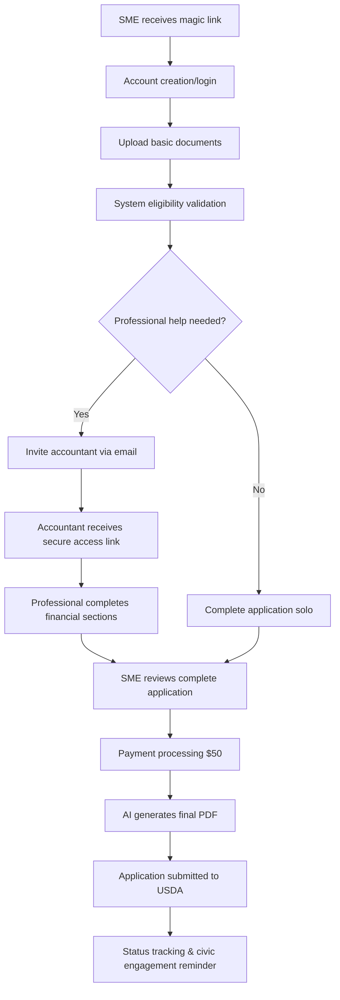

# reapSpring UI/UX Specification

*Generated using BMAD Core UI/UX Specification Template v2.0*

---

## Introduction

This document defines the user experience goals, information architecture, user flows, and visual design specifications for reapSpring's user interface. It serves as the foundation for visual design and frontend development, ensuring a cohesive and user-centered experience.

## Overall UX Goals & Principles

### Target User Personas

**Solar Consultants:** Professionals pivoting from residential to commercial markets who need immediate REAP expertise without months of training

**Rural SME Owners:** Business owners in rural areas (<50K population) seeking 25-50% federal funding with minimal administrative burden

**Consultant Managers:** Team leaders overseeing 2-50+ consultants who need visibility into commercial market transition progress

**Delegated Professionals:** Accountants, advisors, and engineers providing specialized data sections through secure professional workflows

**Account Admins:** Installer company administrators managing platform operations, billing, and user permissions

### Usability Goals

- **Rapid Expertise Transfer:** Consultants can complete REAP applications within 2-4 hours without prior specialized training (vs. current 1-2 week learning curve)
- **Professional Trust Building:** 90%+ of SME owners comfortable delegating financial data through secure invitation system within first use
- **Error Prevention at Scale:** Achieve <5% application rejection rate through built-in compliance validation (vs. 20-30% typical manual rejection rate)
- **Multi-Role Efficiency:** Single platform serves all user types without role-switching friction or duplicate data entry
- **Mobile Accessibility:** Rural users can complete essential tasks on mobile devices with spotty connectivity
- **Payment Transparency:** 95%+ payment conversion with clear cost understanding across all routing scenarios

### Design Principles

1. **Guided Simplicity Over Feature Density** - Reveal complexity progressively rather than overwhelming users with all capabilities upfront
2. **Trust Through Transparency** - Every process step is visible and explainable, countering skepticism of "black box" government systems
3. **Professional Delegation First** - Design workflows that enhance rather than replace existing SME-professional relationships
4. **Role-Adaptive Intelligence** - Interface adapts contextually based on user role and application state rather than one-size-fits-all
5. **Rural-First Accessibility** - Optimize for limited bandwidth, older devices, and varying technology comfort levels

### Change Log
| Date | Version | Description | Author |
|------|---------|-------------|---------|
| 2025-09-09 | v1.0 | Initial UI/UX specification creation | Sally (UX Expert) |

---

## Information Architecture (IA)

### Site Map / Screen Inventory

```mermaid
graph TD
    A[Landing/Auth Hub] --> B[Consultant Dashboard]
    A --> C[Manager Dashboard] 
    A --> D[Account Admin Panel]
    A --> E[SME Application Portal]
    A --> F[Professional Delegation Interface]
    
    B --> B1[Application Queue]
    B --> B2[SME Client Management]
    B --> B3[Application Builder]
    B --> B4[Performance Metrics]
    
    C --> C1[Team Oversight]
    C --> C2[Application Pipeline]
    C --> C3[Revenue Tracking]
    C --> C4[Consultant Assignment]
    
    D --> D1[Company Settings]
    D --> D2[User Management] 
    D --> D3[Billing Configuration]
    D --> D4[Payment Routing Setup]
    
    E --> E1[Document Upload Hub]
    E --> E2[Professional Invitation]
    E --> E3[Application Review]
    E --> E4[Payment Processing]
    E --> E5[Status Tracking]
    
    F --> F1[Section-Specific Access]
    F --> F2[Professional Contribution]
    F --> F3[Review & Submit]
    
    B3 --> G[Shared Application Engine]
    E3 --> G
    F3 --> G
    G --> G1[AI Generation]
    G --> G2[Compliance Validation]
    G --> G3[PDF Export]
```

### Navigation Structure

**Primary Navigation:** Role-adaptive header navigation that changes based on user type:
- **Consultants:** Dashboard | Applications | Clients | Help
- **Managers:** Overview | Team | Pipeline | Analytics  
- **Account Admins:** Company | Users | Billing | Settings
- **SME Owners:** My Application | Documents | Professionals | Status
- **Professionals:** Assigned Sections | Review | Complete

**Secondary Navigation:** Contextual sidebar within each major section providing granular access to subsections and workflow steps

**Breadcrumb Strategy:** Dynamic breadcrumbs reflecting both organizational hierarchy (Company > Manager > Consultant > SME) and workflow progress (Upload > Review > Professional Input > Payment > Submit)

---

## User Flows

### SME Owner REAP Application with Professional Delegation

**User Goal:** Complete REAP application leveraging trusted accountant for financials while maintaining control over the process

**Entry Points:** 
- Magic link invitation from Consultant
- Direct registration via reapSpring marketing
- Referral from professional network

**Success Criteria:** 
- Application submitted within 4 hours
- Professional completes financial sections accurately  
- Payment processed successfully ($50 flat fee)
- Generated PDF passes USDA compliance validation

#### Flow Diagram

#### Edge Cases & Error Handling:
- **Professional non-response:** SME can complete sections directly or invite different professional with 48-hour timeout
- **Document validation failure:** Contextual guidance with specific requirements and re-upload capability  
- **Payment processing error:** Clear retry mechanism with alternative payment methods
- **Farmland ground-mount detection:** Hard stop with explanation and alternative system suggestions
- **Rural area ineligibility:** Immediate notification with nearest eligible location suggestions

**Notes:** This flow prioritizes professional delegation as a choice rather than requirement, maintaining SME autonomy while leveraging existing relationships.

---

## Wireframes & Mockups

**Primary Design Files:** Figma workspace for detailed visual specifications and developer handoff with interactive prototyping for user testing critical professional delegation workflows

### Key Screen Layouts

#### SME Application Dashboard
**Purpose:** Primary interface where rural business owners manage their REAP application with professional delegation capabilities

**Key Elements:**
- **Application Progress Indicator:** Clear 5-step visualization (Documents → Professionals → Review → Payment → Submit)
- **Professional Invitation Panel:** Prominent section for inviting accountants/advisors with secure access explanation
- **Document Upload Hub:** Drag-and-drop interface with clear federal requirement explanations
- **Trust Indicators:** Security badges, professional verification status, and compliance validation checkmarks
- **Help Integration:** Contextual REAP guidance without overwhelming the interface

**Interaction Notes:** Professional invitations are contextual - only appear when relevant document sections need specialized expertise. Upload validation happens real-time with friendly error explanations.

**Design File Reference:** `/figma/sme-dashboard-main` (to be created)

#### Professional Delegation Interface  
**Purpose:** Secure, time-limited interface for invited professionals to complete assigned data sections

**Key Elements:**
- **Section Scope Clarity:** Prominent display of exactly which data sections professional is authorized to complete
- **Client Context Panel:** Essential SME business information to inform professional contributions
- **Granular Permission Status:** Visual indicators showing what data the professional can/cannot access
- **Progress Tracking:** Clear indication of completion status and remaining tasks
- **Secure Submission Flow:** Obvious submission button with professional liability acknowledgment

**Interaction Notes:** Interface emphasizes limited scope and time-bound access. Professional sees only authorized sections with clear boundaries. Auto-save functionality prevents data loss during session timeouts.

**Design File Reference:** `/figma/professional-interface-secure` (to be created)

#### Consultant Application Builder
**Purpose:** Guided interface for solar consultants to manage SME client applications with AI assistance

**Key Elements:**
- **Client Assignment Panel:** Clear display of assigned SME clients with application status
- **AI-Powered Guidance:** Embedded REAP expertise with eligibility validation and scoring optimization
- **Professional Coordination View:** Oversight of delegated professional contributions without data access
- **Compliance Validation Dashboard:** Real-time feedback on application completeness and federal requirements
- **Batch Application Management:** Ability to track multiple concurrent applications

**Interaction Notes:** Design emphasizes consultant as facilitator rather than data controller. Professional delegation workflows are visible but not directly manageable by consultants, preserving SME-professional relationships.

**Design File Reference:** `/figma/consultant-builder-main` (to be created)

---

## Component Library / Design System

**Design System Approach:** Hybrid system using Tailwind CSS utilities as the foundation with shadcn/ui components, extended with custom components for professional delegation, rural-friendly interfaces, and compliance validation features.

### Core Components

#### Professional Invitation Card
**Purpose:** Secure interface for SME owners to invite and manage delegated professionals (accountants, advisors, engineers)

**Variants:** 
- **Invitation State:** Empty state prompting professional invitation with trust indicators
- **Pending State:** Shows invited professional with secure access link status
- **Active State:** Professional currently working with progress indicators and time remaining
- **Complete State:** Professional contribution finished with review option

**States:** Default, Hover, Loading, Error, Success, Disabled, Time-expired

**Usage Guidelines:** Always include security explanation and professional liability context. Emphasize SME control over professional access. Display clear time limits and scope boundaries.

#### Compliance Validation Badge
**Purpose:** Real-time feedback on REAP application compliance to prevent federal rejection

**Variants:**
- **Eligible Badge:** Green checkmark with brief explanation (e.g., "Rural area confirmed")
- **Warning Badge:** Yellow alert for potential issues (e.g., "Ground-mount on farmland detected")
- **Error Badge:** Red stop indicator for blocking issues (e.g., "NAICS code ineligible")
- **Pending Badge:** Gray loading state during validation checks

**States:** Validating, Valid, Warning, Error, Info

**Usage Guidelines:** Badge explanations use plain language rather than federal jargon. Always provide actionable next steps for warnings and errors. Include links to relevant USDA documentation when helpful.

#### Role-Adaptive Navigation
**Purpose:** Dynamic navigation that adapts based on user role while maintaining consistency

**Variants:**
- **Consultant Nav:** Dashboard, Applications, Clients, Help
- **Manager Nav:** Overview, Team, Pipeline, Analytics
- **SME Nav:** My Application, Documents, Professionals, Status
- **Professional Nav:** Assigned Sections, Review, Complete
- **Admin Nav:** Company, Users, Billing, Settings

**States:** Active, Inactive, Disabled, Notification badge, Loading

**Usage Guidelines:** Navigation persists user context across role switches. Notification badges indicate pending actions (invited professionals, incomplete applications, payment required). Role identification is always visible to prevent confusion.

#### Document Upload Hub
**Purpose:** Rural-friendly document upload interface with federal requirement guidance

**Variants:**
- **Empty State:** Drag-and-drop area with clear document requirements and examples
- **Upload Progress:** File upload with progress indicators and validation feedback
- **Success State:** Uploaded documents with preview and replacement options
- **Professional Access:** Shows which uploaded documents professionals can access

**States:** Empty, Dragging, Uploading, Processing, Success, Error, Professional-accessible

**Usage Guidelines:** Support multiple file formats (PDF, JPG, Excel). Provide clear examples of acceptable documents. Include file size and format validation with helpful error messages. Show professional access permissions clearly.

#### Payment Routing Controller
**Purpose:** Account Admin interface for configuring flexible payment routing (company vs. SME direct payment)

**Variants:**
- **Company Payment Mode:** All applications billed to installer company account
- **Client Payment Mode:** SME owners pay directly for applications
- **Hybrid Mode:** Configurable per-application payment routing
- **Professional-Assisted Mode:** Payment routing when professionals are involved

**States:** Configured, Editing, Saving, Error, Requires-approval

**Usage Guidelines:** Include clear cost implications for each routing mode. Provide payment history and forecasting. Require confirmation for routing changes that affect active applications.

---

## Branding & Style Guide

### Visual Identity
**Brand Guidelines:** Core brand elements established for October 1st launch with full brand guidelines development in Phase 2. Focus on trust-building and accessibility for rural users.

### Color Palette

| Color Type | Hex Code | Usage |
|------------|----------|-------|
| Primary | #2563eb | Primary actions, trusted elements, consultant workflows |
| Secondary | #059669 | Success states, approval indicators, professional verification |
| Accent | #dc2626 | Critical alerts, compliance warnings, urgent actions |
| Success | #10b981 | Positive feedback, application approvals, completed sections |
| Warning | #f59e0b | Cautions, potential issues, professional delegation timeouts |
| Error | #ef4444 | Errors, compliance failures, payment failures |
| Neutral | #6b7280 | Text, borders, backgrounds, secondary information |

### Typography

#### Font Families
- **Primary:** Inter (web-safe, highly readable, professional appearance)
- **Secondary:** System font stack (SF Pro Display, Segoe UI, Roboto) for platform consistency
- **Monospace:** JetBrains Mono for technical data, application IDs, and code references

#### Type Scale

| Element | Size | Weight | Line Height |
|---------|------|--------|-------------|
| H1 | 2.25rem (36px) | 700 | 1.2 |
| H2 | 1.875rem (30px) | 600 | 1.3 |
| H3 | 1.5rem (24px) | 600 | 1.4 |
| Body | 1rem (16px) | 400 | 1.6 |
| Small | 0.875rem (14px) | 400 | 1.5 |

### Iconography

**Icon Library:** Lucide (clean, consistent design with excellent React/TypeScript support for Next.js + Convex stack)

**Usage Guidelines:** 
- Use outlined icons for navigation and secondary actions
- Use filled variants (where available) for completed states and primary actions  
- Professional delegation icons use shield/lock metaphors to emphasize security (Shield, ShieldCheck, Lock)
- Compliance validation icons use checkmarks/warnings that are colorblind-friendly (CheckCircle, AlertTriangle, XCircle)
- All icons include text labels for accessibility and rural user clarity

### Spacing & Layout

**Grid System:** 12-column CSS Grid with container max-widths:
- Mobile: 100% (with 1rem padding)
- Tablet: 768px 
- Desktop: 1024px
- Wide: 1280px

**Spacing Scale:** Tailwind CSS spacing scale (0.25rem increments) with emphasis on generous whitespace for rural users who may be less comfortable with dense interfaces

---

## Accessibility Requirements

### Compliance Target
**Standard:** WCAG 2.1 AA compliance with selected AAA elements for critical workflows (payment processing, professional delegation security)

### Key Requirements

**Visual:**
- Color contrast ratios: 4.5:1 minimum for normal text, 3:1 for large text, 7:1 for critical compliance warnings
- Focus indicators: Visible 2px outline with high contrast on all interactive elements
- Text sizing: Minimum 16px base font size, scalable to 200% without horizontal scrolling

**Interaction:**
- Keyboard navigation: Full tab order through all interactive elements, skip links for main content
- Screen reader support: Semantic HTML, ARIA labels for complex components, live regions for status updates
- Touch targets: Minimum 44px×44px for all interactive elements, increased spacing on mobile

**Content:**
- Alternative text: Descriptive alt text for informational images, decorative images marked appropriately
- Heading structure: Logical H1-H6 hierarchy with no skipped levels, role-based heading context
- Form labels: Clear, persistent labels for all form inputs with helpful error messaging

### Testing Strategy
Automated testing with axe-core integrated into development workflow, manual testing with NVDA/JAWS screen readers, keyboard-only navigation testing for all critical user flows including professional delegation workflows.

---

## Responsiveness Strategy

### Breakpoints

| Breakpoint | Min Width | Max Width | Target Devices |
|------------|-----------|-----------|----------------|
| Mobile | 320px | 767px | Smartphones, rural users with older devices |
| Tablet | 768px | 1023px | iPads, consultant field work, SME owners |
| Desktop | 1024px | 1279px | Office computers, professional workstations |
| Wide | 1280px | - | Manager dashboards, multi-application workflows |

### Adaptation Patterns

**Layout Changes:** 
- Mobile: Single-column layout with stacked components, professional delegation flows simplified to sequential steps
- Tablet: Two-column layout where appropriate, side-by-side document upload and professional invitation
- Desktop: Multi-column dashboards with contextual sidebars, full professional oversight capabilities
- Wide: Advanced multi-pane layouts for managers overseeing multiple consultants and applications

**Navigation Changes:**
- Mobile: Hamburger menu with role-specific navigation, bottom tab bar for primary actions
- Tablet: Collapsed sidebar navigation with expandable sections
- Desktop: Full sidebar navigation with secondary menu levels
- Wide: Persistent navigation with advanced filtering and search capabilities

**Content Priority:**
- Mobile: Progressive disclosure with primary actions emphasized, professional delegation status front-and-center
- Tablet: Balanced content with collapsible secondary information
- Desktop: Full context available with optional information panels
- Wide: Comprehensive dashboards with all available data and controls

**Interaction Changes:**
- Mobile: Large touch targets (minimum 44px), simplified professional invitation flows, one-handed operation support
- Tablet: Mixed touch and keyboard input, optimized for document upload and review
- Desktop: Keyboard shortcuts, hover states, efficient bulk operations
- Wide: Advanced keyboard navigation, multi-selection capabilities, power user features

---

## Animation & Micro-interactions

### Motion Principles
**Performance-First Motion:** All animations must maintain 60fps performance and respect user preference for reduced motion (prefers-reduced-motion). Animations serve functional purposes - providing feedback, guiding attention, and building confidence in secure professional delegation workflows.

### Key Animations

- **Professional Invitation Send:** Subtle scale and color transition on invitation button (Duration: 200ms, Easing: ease-out) with success checkmark animation
- **Document Upload Progress:** Smooth progress bar with file validation feedback (Duration: Variable based on upload, Easing: linear) 
- **Compliance Validation:** Real-time badge state transitions with gentle pulse for warnings (Duration: 300ms, Easing: ease-in-out)
- **Professional Access Granted:** Secure lock-to-unlock transition when professional accesses assigned sections (Duration: 400ms, Easing: ease-out)
- **Application Generation:** Progress indicator with estimated completion time and AI processing feedback (Duration: 2-5 seconds, Easing: ease-in-out)
- **Payment Processing:** Loading state with secure transaction indicators and success confirmation (Duration: Variable, Easing: ease-out)
- **Role Navigation:** Smooth role context switching with subtle slide transitions (Duration: 250ms, Easing: ease-in-out)
- **Form Validation:** Immediate feedback on input fields with error shake animation (Duration: 150ms, Easing: ease-out)

---

## Performance Considerations

### Performance Goals
- **Page Load:** Initial page load under 2 seconds on 3G connections (rural connectivity reality)
- **Interaction Response:** UI interactions respond within 100ms, form validation within 200ms
- **Animation FPS:** Maintain 60fps for all animations, graceful degradation on older devices

### Design Strategies
**Rural-First Performance:** Design decisions prioritize functionality over visual complexity to support users on slower connections and older devices. Professional delegation workflows load progressively - core functionality available immediately with enhanced features loading asynchronously. AI application generation provides clear progress feedback with estimated completion times (2-5 seconds target) and fallback messaging for longer processing. Document uploads include compression and format optimization to minimize bandwidth usage while maintaining federal compliance requirements.

---

## Next Steps

### Immediate Actions

1. **Stakeholder Review & Validation:** Review this UI/UX specification with development team, validate technical feasibility of professional delegation security components within 25-day timeline
2. **Design System Implementation:** Set up Tailwind CSS + shadcn/ui foundation with Lucide icons, establish color palette and typography system in Next.js project
3. **Professional Delegation Security Architecture:** Design and validate Convex schema for granular access controls, magic link invitation system, and audit trail implementation
4. **Critical User Flow Prototyping:** Create clickable Figma prototypes for SME professional delegation workflow and consultant application builder for early user validation
5. **Rural User Testing Setup:** Arrange testing sessions with target SME owners and solar consultants to validate professional delegation trust and usability assumptions

### Design Handoff Checklist

- [x] All user flows documented
- [x] Component inventory complete
- [x] Accessibility requirements defined
- [x] Responsive strategy clear
- [x] Brand guidelines incorporated
- [x] Performance goals established

**Critical Success Factors for October 1st Launch:**
- **Professional delegation security** must be bulletproof - any security issues will destroy platform credibility
- **Rural user accessibility** cannot be compromised - these users have limited technology tolerance for complex interfaces
- **Trust-building transparency** in every workflow - users need to understand what's happening with their financial data
- **Mobile-first professional workflows** - field consultants and rural SMEs will primarily use mobile devices
- **AI processing transparency** - clear progress indicators and fallback messaging for application generation

This UI/UX specification provides the foundation for reapSpring's October 1st launch success. The design approach balances rapid development needs with the trust-building and professional delegation requirements that differentiate your platform from existing solutions.

---